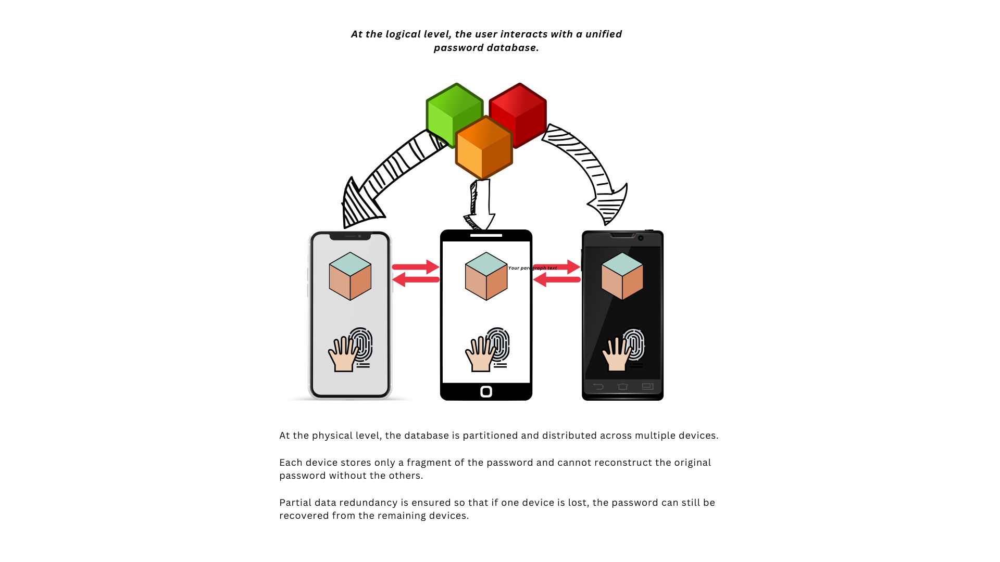
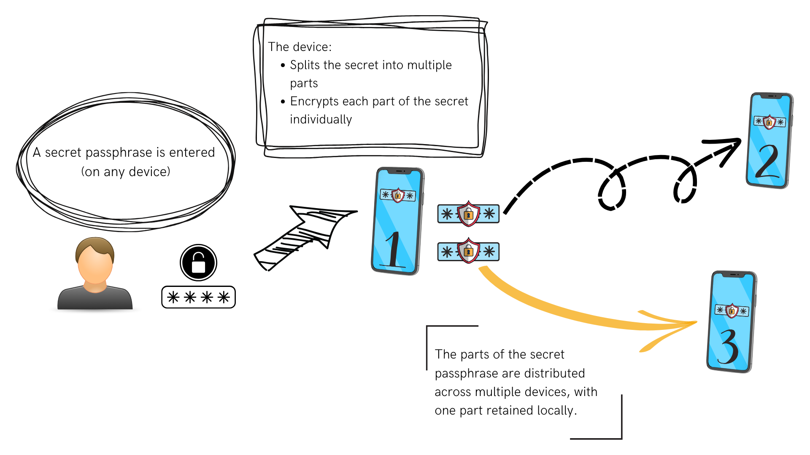
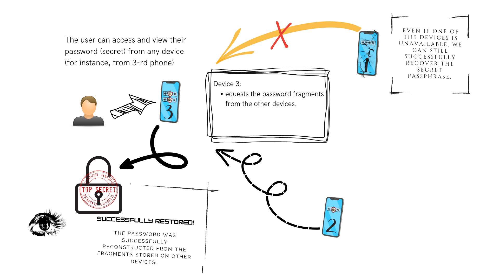
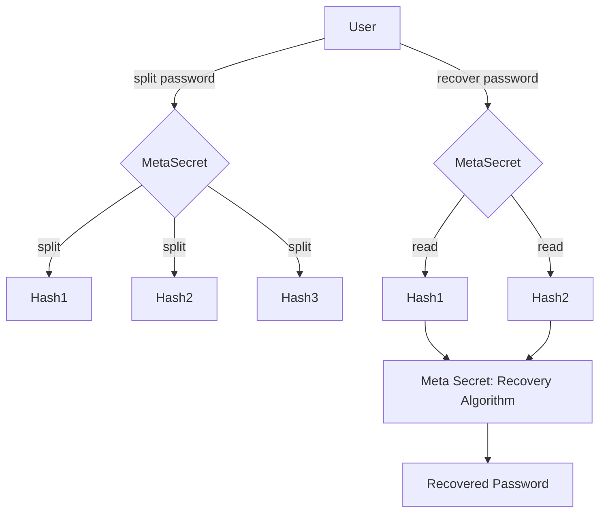
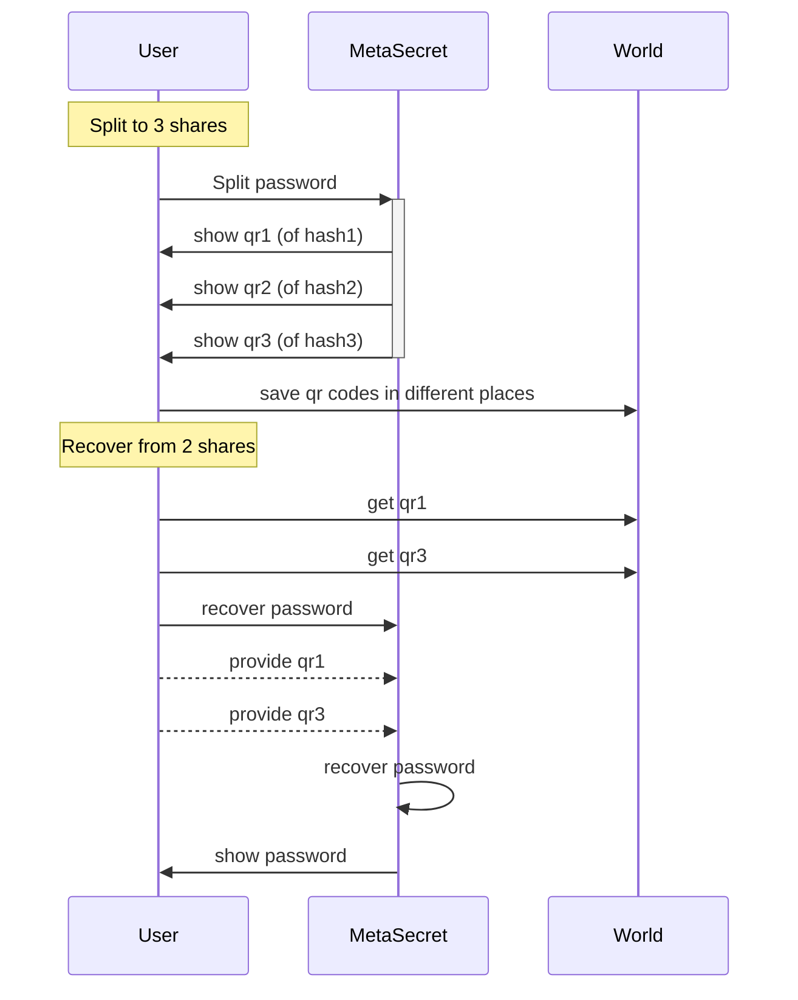

<p align="center">
  
  
  <h4 align="center"> <a href="https://apps.apple.com/app/metasecret/id1644286751">Meta Secret Mobile Application</a></h4>
  
  <h5 align="center"> <a href="https://meta-secret.org">Web site</a> </h5>
  <h5 align="center"> <a href="https://meta-secret.github.io">Meta Secret Web App</a> </h5>
</p>

### MetaSecret Application 
Meta Secret is a decentralised password manager that uses advanced encryption and decentralised storage to securely store and manage user data.

Meta Secret does not rely on a master password to grant access to passwords.

Instead, it uses a combination of biometric authentication and secret sharing techniques to provide secure access to user's confidential information.

Meta Secret is designed to operate on your device(s), the data is encrypted to ensure your information remains private and protected, enabling users to access their passwords from any device without compromising security.

Meta Secret also features a decentralised and open-source infrastructure, providing increased security and privacy for users.

### Application Design

#### Application Structure


#### Password Split


#### Password Recovery



<br>
<br>

#### Activity Diagram

```mermaid
graph TD
    User --> |split password| MSS{MetaSecret}
    MSS --> |split| Hash1
    MSS --> |split| Hash2
    MSS --> |split| Hash3
    
    User --> |recover password| MSR{MetaSecret}
    MSR --> |read| HH1[Hash1]
    MSR --> |read| HH2[Hash2]
    HH1 --> RecoverAlgo[Meta Secret: Recovery Algorithm]
    HH2 --> RecoverAlgo
    RecoverAlgo --> RP[Recovered Password]
```

#### Sequence Diagram

```mermaid
sequenceDiagram
    note over User: Split to 3 shares
    User->>+MetaSecret: Split password
    
    MetaSecret->>User: show qr1 (of hash1)
    MetaSecret->>User: show qr2 (of hash2)
    MetaSecret->>-User: show qr3 (of hash3)
    User ->> World: save qr codes in different places

    note over User: Recover from 2 shares
    User ->> World: get qr1
    User ->> World: get qr3

    User ->> MetaSecret: recover password
    User -->> MetaSecret: provide qr1
    User -->> MetaSecret: provide qr3
    MetaSecret ->> MetaSecret: recover password
    MetaSecret ->> User: show password
```

## AI-assisted development

This repository defines a **phased workflow** (plan → implement → test → verify → review → release) with **human approval** between phases. Canonical rules live in markdown at the **repository root**; agents and skills mirror the same discipline. **Cargo workspace root:** `meta-secret/` (see [PROJECT_CONTEXT.md](PROJECT_CONTEXT.md)).

### Read first (everyone)

| Document | Purpose |
|----------|---------|
| [CLAUDE.md](CLAUDE.md) | How AI tools should behave in this repo (short index). |
| [WORKFLOW.md](WORKFLOW.md) | Full pipeline: agents, approvals, optional steps, skills table. |
| [PROJECT_CONTEXT.md](PROJECT_CONTEXT.md) | Workspace layout, crates, build/test commands, link to mobile consumer. |
| [ARCHITECTURE.md](ARCHITECTURE.md) | Crates, crypto boundary, server vs client, FFI. |
| [SECURITY.md](SECURITY.md) | Keys, logging, crypto hygiene. |
| [CODE_STYLE.md](CODE_STYLE.md) | Rust conventions. |

Skills live under [`.claude/skills/`](.claude/skills/). Subagent prompts: [`.cursor/agents/`](.cursor/agents/) and [`.claude/agents/`](.claude/agents/).

---

### Claude Code

1. Open **this repo** in Claude Code so it loads [`.claude/`](.claude/).
2. **Slash commands:** [`.claude/commands/`](.claude/commands/).

**Start a full delivery chain**

| Command | When |
|---------|------|
| `/only-issue-coordinator` | GitHub issue number or URL (`gh` available). |
| `/only-from-prompt` | Free-text feature/bug description only. |

**Run a single phase**

| Command | Phase |
|---------|--------|
| `/only-issue-coordinator` | GitHub issue summary |
| `/only-planner` | Plan only (`feature-planner`) |
| `/only-implementer` | Implement approved plan |
| `/only-test-author` | Add/update tests |
| `/only-test-verifier` | Run tests / interpret report |
| `/only-debug-rca` | Debug / root cause |
| `/only-reviewer` | Code review (read-only) |
| `/only-release-notes` | MR / changelog text |
| `/only-release-manager` | Branch, commit, push (only after explicit ok) |
| `/only-workflow-pattern-capture` | Optional: 0–2 process improvements |

3. After each phase, **approve** the artifact before the next step. Run phases from the **main** session (no nested subagents).

4. **Build/test hints:** from `meta-secret/`, `cargo test`, `cargo clippy`; project-wide Docker: `docker buildx bake test` (see [Infrastructure Build](#infrastructure-build) below).

---

### Cursor

Cursor does **not** load `.claude/commands/` as slash commands. Use **Agent** chat; parity: [`.cursor/commands/README.md`](.cursor/commands/README.md).

1. **Rules:** [`.cursor/rules/`](.cursor/rules/) — `ai-project-context.mdc` pulls the root markdown documents.
2. **Invoke a phase:** `/feature-planner` or “Use the **feature-planner** subagent: …” — see [`.cursor/agents/`](.cursor/agents/).
3. **Skills:** ask Agent to read `SKILL.md` under [`.claude/skills/<name>/`](.claude/skills/) when needed.
4. **Pipeline:** [WORKFLOW.md](WORKFLOW.md). **FFI changes:** coordinate with **meta-secret-compose**.

---

### Optional: pattern capture

When triggers in [WORKFLOW.md](WORKFLOW.md) apply, run **`workflow-pattern-capture`** with skill **`workflow-pattern-capture`** (0–2 suggestions or **No changes recommended**).

---

### Historical note

Older references may point to `docs/ai-skills.md`. Current entry points are this section and [WORKFLOW.md](WORKFLOW.md).

## Web Application
Meta Secret Web Cli is available on https://meta-secret.github.io

## Command Line App

#### Split secrets:
You can split and restore your secrets by using meta-secret cli app in docker.
<br>
Imagine that we want to split `top$ecret`, then the command will be: 

```bash
$ mkdir secrets
$ docker run -ti --rm -v "$(pwd)/secrets:/app/secrets" ghcr.io/meta-secret/cli:latest split --secret top$ecret 
```

It will generate json/qr(jpg) files (shares of your secert) in the `secrets` directory.

#### Restore secrets:
When it comes to restore the secret, put json or qr files (shares of your secret) into the `secrets` directory.
Then run in case of qr (if you want restore from json, just pass --from json ):

```bash
$ docker run -ti --rm -v "$(pwd)/secrets:/app/secrets" ghcr.io/meta-secret/cli:latest restore --from qr 
```

## Advice for VPS-users
If you don't want to use FileZilla to download QR-codes to see on your computer, you can see them in terminal.

#### Installation
```bash
$ brew install qrencode (MacOS)
$ apt-get install qrencode (Debian/Ubuntu)
$ dnf install qrencode (CentOS/Rocky/Alma)
```

#### Showing QR codes in terminal
```bash
$ qrencode -t ansiutf8 < meta-secret-1.json
```

Congrats! Save these codes in secure place!

Below is optional
If you would like to extract data from QR's
  * Just take a phone to scan QR
  * or screenshot the terminal and upload it on this website: [webqr.com](https://webqr.com)

<br>

## Infrastructure Build

The project uses `docker buildx bake` as its build system. All build targets are defined in `docker-bake.hcl`.

### Build commands

```bash
# Build and push all images (meta-server + web)
docker buildx bake --push default

# Build meta-server image
docker buildx bake meta-server-image

# Build web image
docker buildx bake web-image

# Run tests
docker buildx bake test

# Export web-cli dist locally
docker buildx bake web-local

# Build taskomatic-ai
docker buildx bake taskomatic-ai
```

<br>

# Taskomatic AI Docker Image

This Docker image contains the [aider](https://github.com/paul-gauthier/aider) AI coding assistant configured to use Claude 3.5 Haiku.

## Requirements

- Docker installed
- An Anthropic API key

## Usage

Run the container with your Anthropic API key as an environment variable:

```bash
docker run -it --rm \
  -e ANTHROPIC_API_KEY=your-api-key-here \
  -v $(pwd):/workspace \
  localhost/taskomatic-ai:latest
```

### Additional options

The container is pre-configured with Claude 3.5 Haiku, but you can pass additional arguments to aider:

```bash
# Run with a directory mounted and specific files to edit
docker run -it --rm \
  -e ANTHROPIC_API_KEY=your-api-key-here \
  -v $(pwd):/workspace \
  -w /workspace \
  localhost/taskomatic-ai:latest your_file.py another_file.js
```

## Building the image

```bash
docker buildx bake taskomatic-ai
```

## Issues and improvements

If you encounter any issues or have suggestions for improvements, please report them to the project maintainers.
