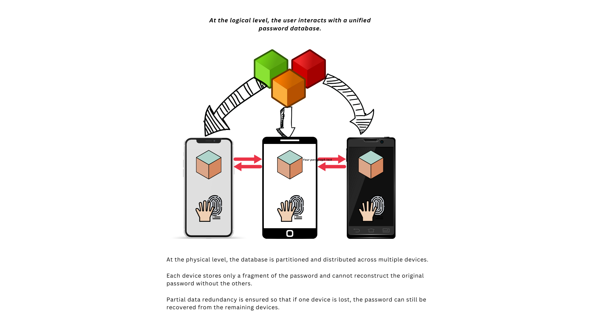

<p align="center">
  
  
  <h4 align="center"> <a href="https://apps.apple.com/app/metasecret/id1644286751">Meta Secret Mobile Application</a></h4>
  
  <h5 align="center"> <a href="https://meta-secret.org">Web site</a> </h5>
  <h5 align="center"> <a href="https://meta-secret.github.io">Meta Secret Web App</a> </h5>
</p>

### MetaSecret Application 
Meta Secret is a decentralised password manager that uses advanced encryption and decentralised storage to securely store and manage user data.

Meta Secret does not rely on a master password to grant access to passwords.

Instead, it uses a combination of biometric authentication and secret sharing techniques to provide secure access to user's confidential information.

Meta Secret is designed to operate on your device(s), the data is encrypted to ensure your information remains private and protected, enabling users to access their passwords from any device without compromising security.

Meta Secret also features a decentralised and open-source infrastructure, providing increased security and privacy for users.

### Application Design

#### Application Structure


#### Password Split


#### Password Recovery


<br>
<br>

#### Activity Diagram


#### Sequence Diagram


## Web Application
Meta Secret Web Cli is available on https://meta-secret.github.io

## Command Line App

#### Split secrets:
You can split and restore your secrets by using meta-secret cli app in docker.
<br>
Imagine that we want to split `top$ecret`, then the command will be: 

```bash
$ mkdir secrets
$ docker run -ti --rm -v "$(pwd)/secrets:/app/secrets" ghcr.io/meta-secret/cli:latest split --secret top$ecret 
```

It will generate json/qr(jpg) files (shares of your secert) in the `secrets` directory.

#### Restore secrets:
When it comes to restore the secret, put json or qr files (shares of your secret) into the `secrets` directory.
Then run in case of qr (if you want restore from json, just pass --from json ):

```bash
$ docker run -ti --rm -v "$(pwd)/secrets:/app/secrets" ghcr.io/meta-secret/cli:latest restore --from qr 
```

## Advice for VPS-users
If you don't want to use FileZilla to download QR-codes to see on your computer, you can see them in terminal.

#### Installation
```bash
$ brew install qrencode (MacOS)
$ apt-get install qrencode (Debian/Ubuntu)
$ dnf install qrencode (CentOS/Rocky/Alma)
```

#### Showing QR codes in terminal
```bash
$ qrencode -t ansiutf8 < meta-secret-1.json
```

Congrats! Save these codes in secure place!

Below is optional
If you would like to extract data from QR's
  * Just take a phone to scan QR
  * or screenshot the terminal and upload it on this website: [webqr.com](https://webqr.com)

<br>
