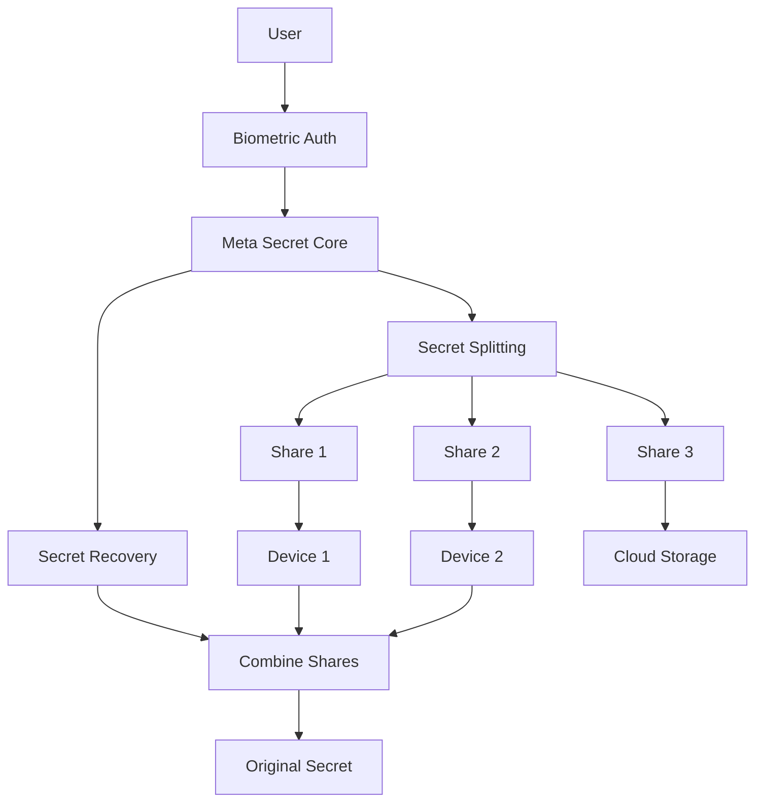
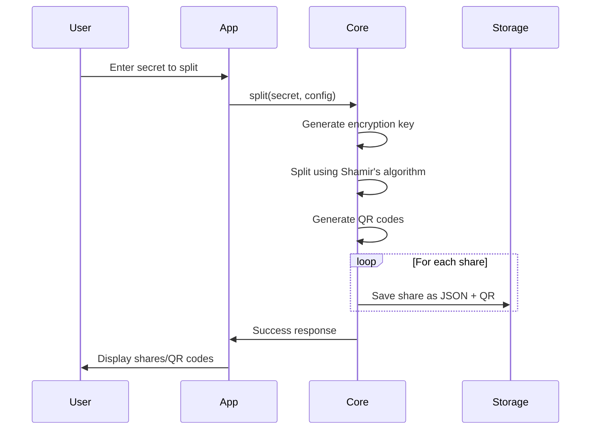
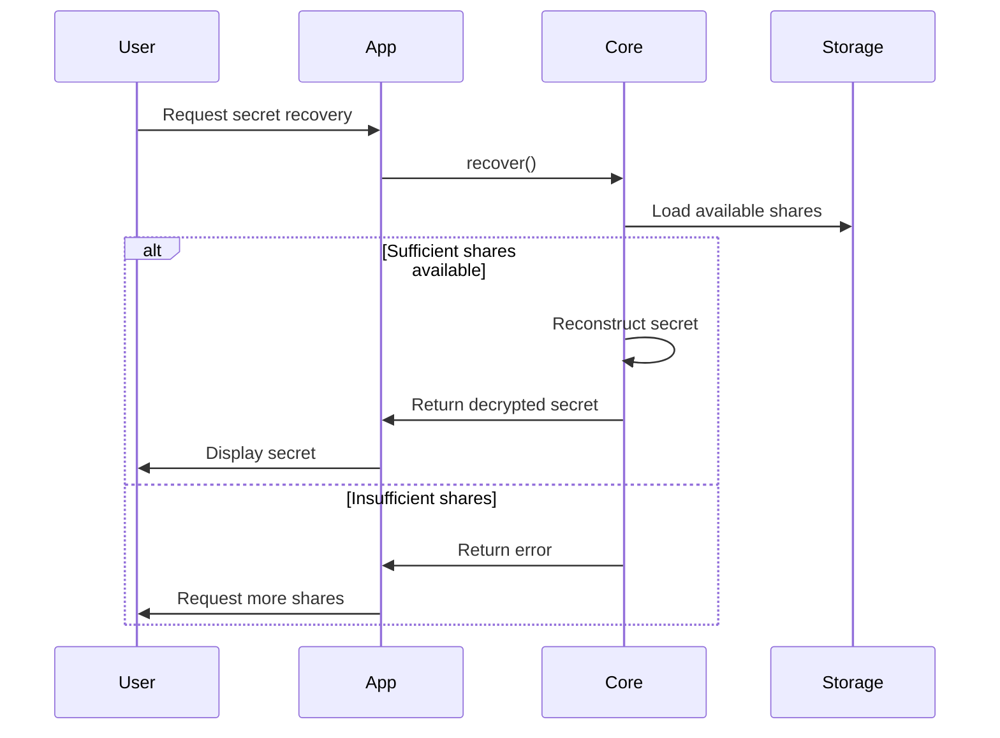
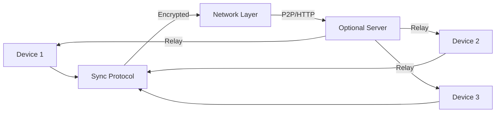
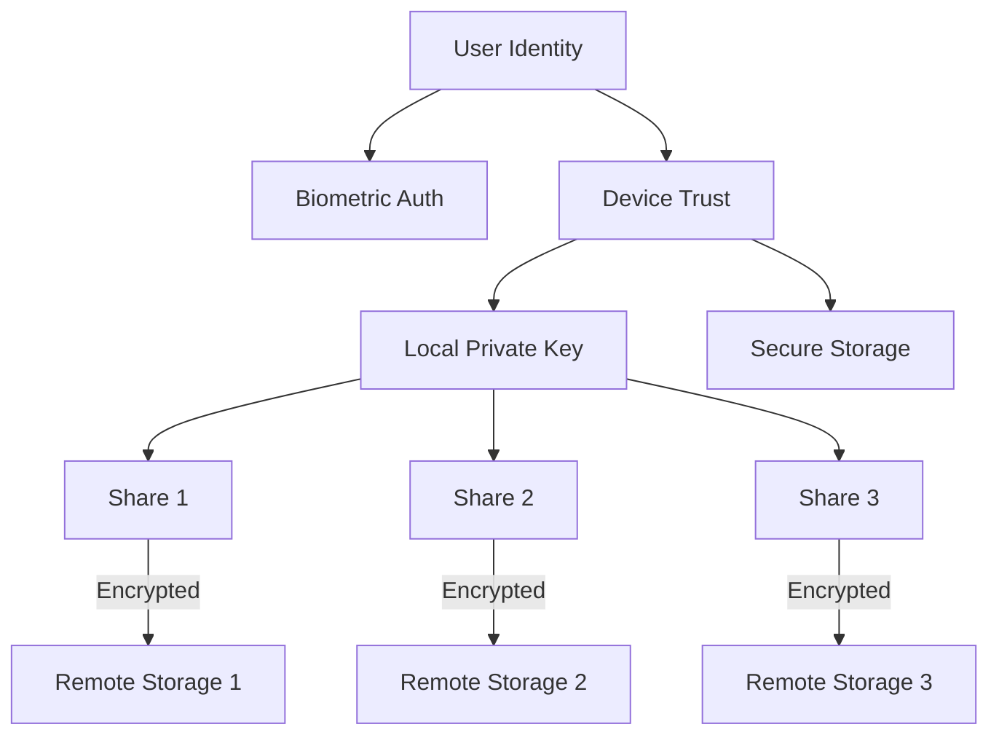
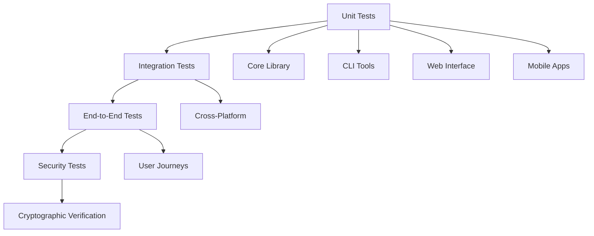
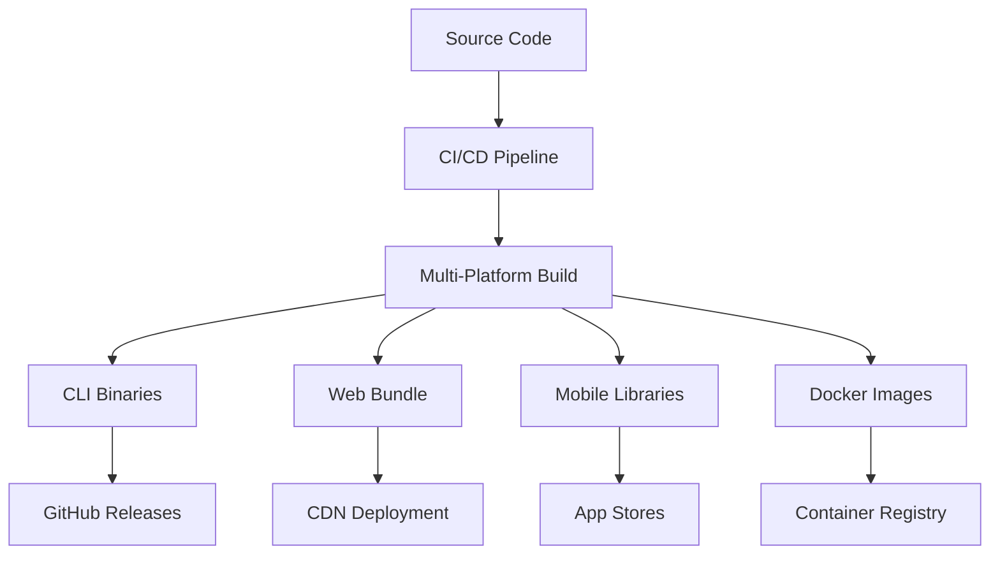

# Meta Secret Architecture

This document provides an overview of Meta Secret's system architecture, component relationships, and design principles.

## Table of Contents

- [System Overview](#system-overview)
- [Core Principles](#core-principles)
- [Component Architecture](#component-architecture)
- [Data Flow](#data-flow)
- [Security Architecture](#security-architecture)
- [Platform Integration](#platform-integration)
- [Storage and Synchronization](#storage-and-synchronization)
- [Development Architecture](#development-architecture)

## System Overview

Meta Secret is a decentralized password manager built around three core innovations:

1. **Shamir Secret Sharing** - Splits secrets into multiple shares
2. **Biometric Authentication** - No master password required
3. **Decentralized Storage** - Data distributed across user devices



## Core Principles

### 1. Zero Trust Architecture
- No single point of failure
- No master password dependency
- Cryptographic verification at every step

### 2. Privacy by Design
- Client-side encryption only
- Minimal data exposure
- User controls all cryptographic keys

### 3. Cross-Platform Compatibility
- Consistent API across all platforms
- Shared cryptographic core
- Platform-specific optimizations

### 4. Developer-Friendly
- Clean separation of concerns
- Well-documented APIs
- Comprehensive testing

## Component Architecture

### Core Library (`meta-secret/core/`)

The foundation containing all cryptographic operations:

```rust
// Main API entry points
pub fn split(secret: String, config: SharedSecretConfig) -> CoreResult<()>
pub fn recover() -> CoreResult<PlainText>
pub fn recover_from_shares(shares: Vec<UserShareDto>) -> CoreResult<PlainText>
```

**Key Modules:**
- `crypto/` - Cryptographic primitives and key management
- `secret/` - Secret sharing implementation
- `node/` - Device coordination and synchronization
- `errors/` - Error handling and types

### Command Line Interfaces

**Basic CLI (`meta-secret/cli/`):**
- Simple split/recover operations
- Docker-optimized
- Minimal dependencies

**Enhanced CLI (`meta-secret/meta-cli/`):**
- Interactive workflows
- User management
- Vault operations
- Device coordination

### WebAssembly Bridge (`meta-secret/wasm/`)

Enables browser integration with native performance:

```javascript
// WASM API example
import init, { split_secret, recover_secret } from './pkg/meta_secret_wasm.js';

await init();
const shares = split_secret("my_secret", { threshold: 2, shares: 3 });
```

### Web Interface (`meta-secret/web-cli/ui/`)

Vue.js application providing:
- User-friendly interface
- Device management
- Secret operations
- Progressive Web App capabilities

### Mobile Integration (`meta-secret/mobile/`)

Platform-specific bindings:
- **iOS**: Swift/Objective-C bindings
- **Android**: JNI bindings
- **Common**: Shared mobile logic

### Server Components (`meta-secret/meta-server/`)

Optional server infrastructure:
- **server-node**: P2P coordination
- **web-server**: HTTP API endpoints

## Data Flow

### Secret Splitting Process



### Secret Recovery Process



### Device Synchronization



## Security Architecture

### Cryptographic Stack

1. **Key Generation**: Ed25519 for signing, Curve25519 for encryption
2. **Secret Sharing**: Shamir's Secret Sharing with configurable threshold
3. **Encryption**: ChaCha20-Poly1305 AEAD
4. **Hashing**: SHA-256 for integrity
5. **Encoding**: Base64 for transport, QR codes for backup

### Trust Model



### Attack Surface Mitigation

- **No master password**: Eliminates password-based attacks
- **Distributed shares**: No single point of compromise
- **Local encryption**: Secrets never leave device unencrypted
- **Biometric binding**: Hardware-backed authentication
- **Perfect forward secrecy**: Key rotation prevents historical compromise

## Platform Integration

### Rust Core

All platforms share the same cryptographic core:

```rust
// Core abstraction layer
pub trait SecretManager {
    fn split_secret(&self, secret: &str, config: Config) -> Result<Vec<Share>>;
    fn recover_secret(&self, shares: Vec<Share>) -> Result<String>;
}

// Platform-specific implementations
impl SecretManager for WebSecretManager { ... }
impl SecretManager for MobileSecretManager { ... }
impl SecretManager for DesktopSecretManager { ... }
```

### Platform-Specific Features

**Web (WASM):**
- Browser storage integration
- Progressive Web App support
- Service worker for offline access

**Mobile:**
- Biometric API integration
- Secure enclave utilization
- Background sync capabilities

**Desktop:**
- System keyring integration
- Native file system access
- OS-specific security features

**Server:**
- High-performance concurrent processing
- Optional coordination services
- API gateway functionality

## Storage and Synchronization

### Local Storage

Each platform implements secure local storage:

```rust
pub trait SecureStorage {
    fn store_share(&self, id: &str, share: &Share) -> Result<()>;
    fn load_share(&self, id: &str) -> Result<Option<Share>>;
    fn list_shares(&self) -> Result<Vec<String>>;
    fn delete_share(&self, id: &str) -> Result<()>;
}
```

### Synchronization Protocol

1. **Discovery**: Devices find each other via mDNS/server
2. **Authentication**: Mutual device verification
3. **Negotiation**: Sync protocol version and capabilities
4. **Transfer**: Encrypted share exchange
5. **Verification**: Cryptographic integrity checks

### Conflict Resolution

- **Device priority**: Newer devices take precedence
- **Timestamp-based**: Latest change wins
- **User intervention**: Manual conflict resolution when needed

## Development Architecture

### Build System

The project uses a multi-layered build system:

1. **Cargo Workspace**: Rust package management
2. **npm**: Web interface dependencies
3. **Docker**: Containerized builds
4. **Earthly**: Reproducible cross-platform builds

### Testing Strategy



### Code Organization

```
meta-secret/
├── core/              # Cryptographic core
│   ├── src/crypto/    # Cryptographic primitives
│   ├── src/secret/    # Secret sharing logic
│   └── src/node/      # Device coordination
├── cli/               # Basic command-line tool
├── meta-cli/          # Enhanced CLI with features
├── wasm/              # WebAssembly bindings
├── web-cli/ui/        # Vue.js web interface
├── mobile/            # Mobile platform bindings
│   ├── ios/           # iOS-specific code
│   ├── android/       # Android-specific code
│   └── common/        # Shared mobile logic
├── meta-server/       # Server components
│   ├── server-node/   # P2P coordination server
│   └── web-server/    # HTTP API server
├── db/                # Database implementations
│   ├── sqlite/        # SQLite backend
│   └── redb/          # Embedded database backend
└── tests/             # Integration tests
```

### Deployment Architecture



## Performance Considerations

### Cryptographic Performance
- Ed25519: ~40,000 signatures/sec
- ChaCha20-Poly1305: ~1GB/sec encryption
- Shamir sharing: Scales linearly with share count

### Memory Usage
- Core library: ~1MB baseline
- WASM bundle: ~500KB compressed
- Mobile overhead: <2MB additional

### Network Efficiency
- Shares typically <1KB each
- QR codes optimized for mobile scanning
- Optional compression for bulk operations

This architecture ensures Meta Secret remains secure, performant, and maintainable across all supported platforms while providing a consistent user experience.