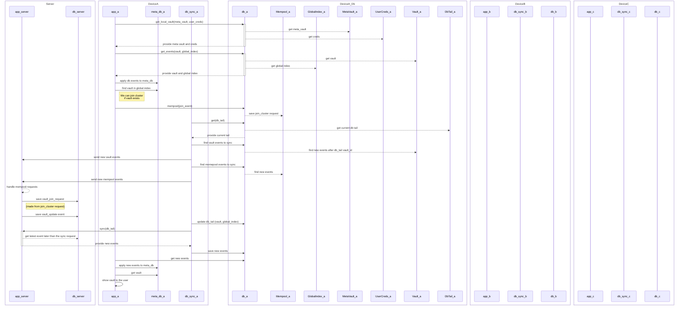

## meta-secret-core

#### "Join Cluster" operation, sequence diagram

```mermaid

sequenceDiagram

    box Server 
        participant app_server
        participant db_server
    end

    box DeviceA 
        participant app_a
        participant meta_db_a
        participant db_sync_a
    end

    box DeviceA_Db
        participant db_a
        participant Mempool_a
        participant GlobalIndex_a
        participant MetaVault_a
        participant UserCreds_a
        participant Vault_a
        participant DbTail_a
    end

    box DeviceB 
        participant app_b
        participant db_sync_b
        participant db_b
    end

    box DeviceC 
        participant app_c
        participant db_sync_c
        participant db_c
    end

app_a ->>+ db_a: get_local_vault(meta_vault, user_creds)
db_a -->> MetaVault_a: get meta_vault
db_a -->> UserCreds_a: get creds
db_a -->>- app_a: provide meta vault and creds

app_a ->>+ db_a: get_events(vault, global_index)
db_a -->> Vault_a: get vault
db_a -->> GlobalIndex_a: get global index
db_a -->>- app_a: provide vault and global index

app_a ->> meta_db_a: apply db events to meta_db

app_a ->> meta_db_a: find vault in global index
Note right of app_a: We can join cluster <br/> if vault exists

app_a ->> db_a: mempool(join_event)
db_a -->> Mempool_a: save join_cluster request

db_sync_a ->> db_a: get(db_tail)
db_a -->> DbTail_a: get current db tail
db_a -->> db_sync_a: provide current tail

db_sync_a ->> db_a: find vault events to sync
db_a -->> Vault_a: find new events after db_tail vault_id
db_sync_a ->> app_server: send new vault events

db_sync_a ->> db_a: find memepool events to sync
db_a -->> Mempool_a: find new events
db_sync_a ->> app_server: send new mempool events

app_server -->> app_server: handle mempool requests
app_server ->> db_server: save vault_join_request
Note right of app_server: (made from join_cluster request)
app_server ->> db_server: save vault_update event

db_sync_a ->> db_a: update db_tail (vault, global_index)

db_sync_a ->>+ app_server: sync(db_tail)
app_server -->> db_server: get latest event later than the sync request
app_server -->>- db_sync_a: provide new events

db_sync_a ->> db_a: save new events
app_a ->> db_a: get new events
app_a ->> meta_db_a: apply new events to meta_db

app_a ->> meta_db_a: get vault
app_a ->> app_a: show vault to the user
```
