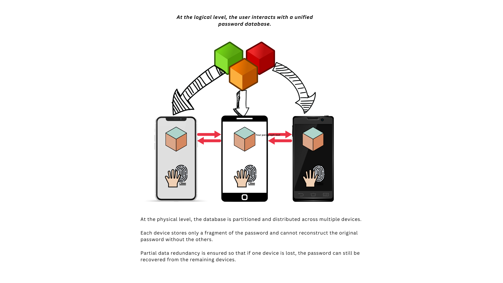
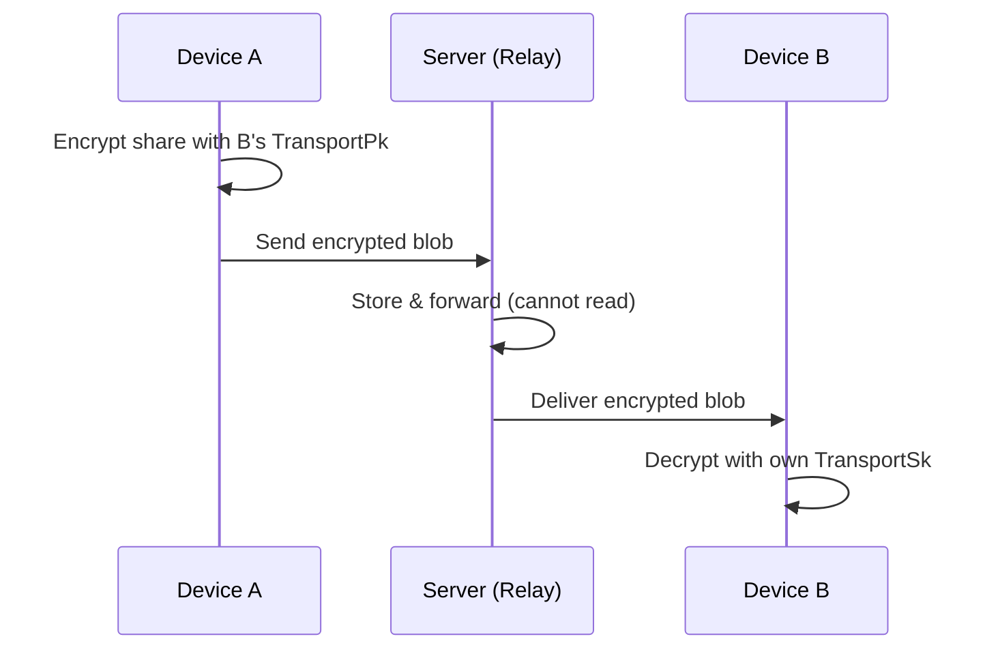
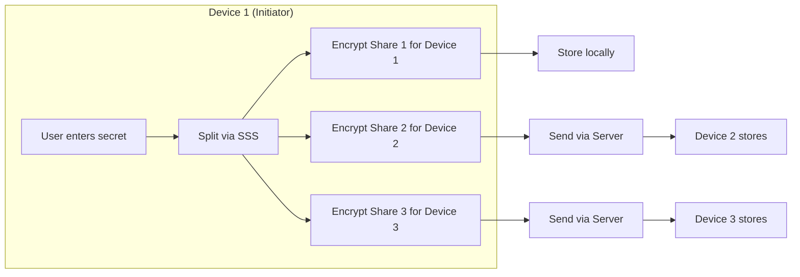
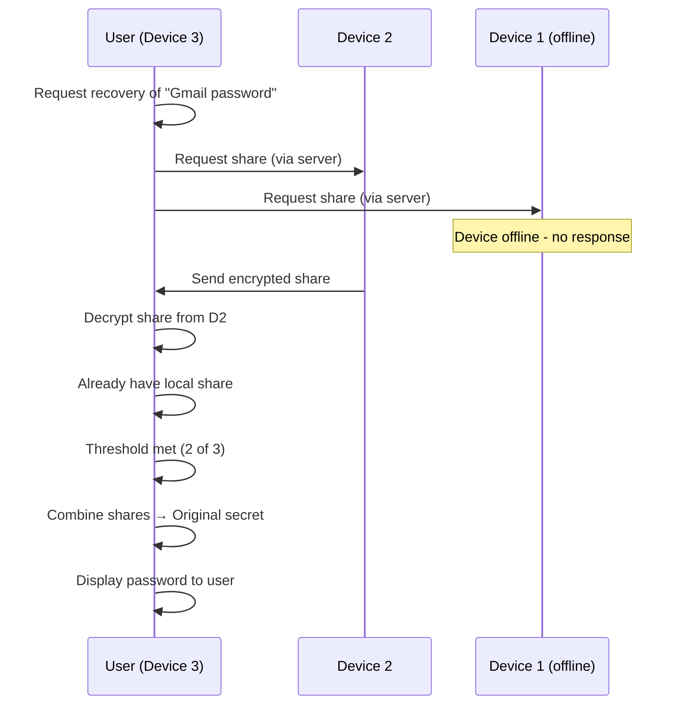
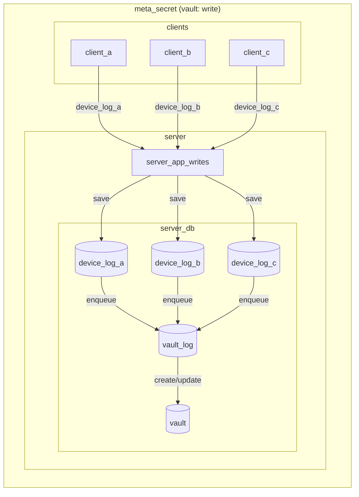

<p align="center">
  
</p>

<h1 align="center">Meta Secret</h1>
<h3 align="center">
    Solving the Master Password Problem with Distributed Cryptography
</h3>

<div align="center">
    <i>Secure Password Management Without a Single Point of Failure</i>
</div>

---

# Slide 2: The Vision

<p align="center">
  
</p>

<p align="center"><em>Your secrets, distributed across multiple secure vaults - no single point of failure</em></p>

> **The Core Idea**: Instead of one master password protecting one vault, 
> Meta Secret distributes your secrets across multiple "vaults" (your devices).
> Opening any single vault reveals nothing - you need a threshold of vaults working together.

---

# Section 1: The Problem

---

# Slide 3: The Paradox of Password Security

## The Problem We All Face

Password managers solve one problem but create another:

```
┌─────────────────────────────────────────────────────────────┐
│                   TRADITIONAL APPROACH                      │
│                                                             │
│    [Password 1]  ─┐                                         │
│    [Password 2]  ─┼──▶  [Master Password]  ──▶  [Access]    │
│    [Password 3]  ─┤          ⚠️                             │
│    [Password N]  ─┘     SINGLE POINT                        │
│                         OF FAILURE                          │
└─────────────────────────────────────────────────────────────┘
```

### The Fundamental Dilemma

| Scenario | Consequence |
|----------|-------------|
| Forget master password | **Lose access to EVERYTHING** |
| Master password compromised | **Attacker gets EVERYTHING** |
| Password manager service down | **No access to any passwords** |

### Same Problem in Crypto

- Seed phrase = master password for your entire wallet
- Lost seed phrase = lost Bitcoin/ETH forever
- No recovery mechanism by design

---

# Slide 4: Why This Problem Matters

## Real-World Impact

### Password Manager Statistics
- Average user has **100+ online accounts**
- 65% of users reuse passwords across multiple sites
- Password manager adoption growing, but **master password anxiety** is a top concern

### Crypto Horror Stories
- **$140 billion** in Bitcoin estimated permanently lost
- James Howells: Lost hard drive with 7,500 BTC (~$500M today)
- Stefan Thomas: Forgot password to IronKey with 7,002 BTC

### The Core Tension

> "The more secure we make the master password, the more likely we are to forget it.
> The easier we make it to remember, the easier it is to compromise."

---

# Slide 5: The Main Question

## Can We Eliminate the Single Point of Failure?

### Requirements for a Solution

1. **No master password** - Nothing to forget or compromise
2. **No central authority** - No single server that holds all secrets
3. **Self-sovereign** - User maintains complete control
4. **Fault tolerant** - Recovery possible even with partial data loss
5. **End-to-end encrypted** - No third party can read secrets

### The Key Insight

> What if we could split a secret so that:
> - No single piece reveals anything
> - Multiple pieces can reconstruct the original
> - Losing some pieces doesn't matter

**This is exactly what Meta Secret does.**

---

# Section 2: The Solution Approach

---

# Slide 6: Shamir's Secret Sharing (SSS)

## The Cryptographic Foundation

Invented by **Adi Shamir** in 1979 (the "S" in RSA)

### The Core Concept

Split a secret into **N shares** where any **K shares** can reconstruct it.

### Concrete Example: Password "123"

```
┌─────────────────────────────────────────────────────────────────────┐
│                    SPLITTING THE SECRET                              │
│                                                                      │
│     Original Password: "123"  (contains digits: 1, 2, 3)            │
│                                                                      │
│                         SPLIT (3 shares, need 2)                     │
│                              │                                       │
│              ┌───────────────┼───────────────┐                      │
│              ▼               ▼               ▼                       │
│         Share A          Share B         Share C                     │
│          [1,2]            [1,3]           [2,3]                      │
│                                                                      │
│     Each share has only PARTIAL information                         │
└─────────────────────────────────────────────────────────────────────┘
```

### Recovery: Any 2 Shares → Original Secret

```
   [1,2] + [1,3]  =  {1,2,3}  →  "123" ✓
   [1,2] + [2,3]  =  {1,2,3}  →  "123" ✓
   [1,3] + [2,3]  =  {1,2,3}  →  "123" ✓
   
   [1,2] alone    =  {1,2,?}  →  ???   ✗  (could be 123, 124, 125...)
```

> **Key property**: 1 share reveals nothing. You need the threshold to recover.

---

# Slide 7: Why Decentralized?

## Architectural Decision: No Trusted Server

### Option A: Store Shares on Server ❌

```
┌──────────────────────────────────────┐
│           CENTRALIZED                │
│                                      │
│  [Device] ──▶ [Server stores all] ◀──│
│                    │                 │
│               Trust the server?      │
│               Server compromised?    │
│               Server goes down?      │
└──────────────────────────────────────┘
```

**Problems:**
- Server becomes new single point of failure
- Must trust server operator
- Regulatory/compliance issues

### Option B: User's Own Devices ✅

```
┌──────────────────────────────────────┐
│          DECENTRALIZED               │
│                                      │
│  [Phone] ◀───▶ [Laptop]             │
│      ▲             ▲                 │
│      └─────────────┘                 │
│           │                          │
│      [Tablet]                        │
│                                      │
│    Server = Dumb Relay Only          │
└──────────────────────────────────────┘
```

**Benefits:**
- No single point of compromise
- User controls the trust boundary
- Works offline (sync when connected)

---

# Section 3: Technical Deep Dive

---

# Slide 8: System Architecture

## Three Core Components

<p align="center">
  
</p>

<p align="center"><em>At the logical level, the user interacts with a unified password database.<br/>
At the physical level, the database is partitioned and distributed across multiple devices.</em></p>

### 1. Vault
- Logical container for user's secrets
- Defines membership (which devices belong)
- Stores secret metadata (not the secrets themselves)

### 2. Devices
- User's registered devices (phone, laptop, tablet)
- Each device has unique cryptographic identity
- Each holds encrypted shares of secrets

### 3. Server
- **Sync relay only** - no business logic
- Cannot decrypt any data
- Routes encrypted messages between devices
- Maintains synchronization state

---

# Slide 9: Device Identity & Communication

## How Devices Discover and Trust Each Other

### Device Identity

Each device generates a cryptographic identity on first run:

```
┌─────────────────────────────────────────────┐
│              DEVICE IDENTITY                │
│                                             │
│  DeviceId ← derived from TransportPk        │
│                                             │
│  TransportPk (Public Key)                   │
│    └─ Used for receiving encrypted shares   │
│                                             │
│  TransportSk (Secret Key)                   │
│    └─ Never leaves the device               │
└─────────────────────────────────────────────┘
```

### Communication Flow



### Key Points

- **End-to-end encryption**: Server sees only ciphertext
- **Public key discovery**: Devices learn each other's keys via vault membership
- **No direct P2P required**: Server handles NAT traversal

---

# Slide 10: The Split Workflow

## What Happens When You Save a Password

<p align="center">
  
</p>

<p align="center"><em>The device splits the secret into multiple parts, encrypts each individually,<br/>
and distributes them across your devices - one part retained locally.</em></p>

### Step-by-Step Process



---

# Slide 11: The Recovery Workflow

## What Happens When You Need a Password

<p align="center">
  
</p>

<p align="center"><em>Even if one device is unavailable, we can still successfully recover the secret.<br/>
The requesting device gathers shares from available devices and reconstructs the password.</em></p>

### Recovery Process



### Key Insight

> Even with one device offline/lost, recovery succeeds if threshold is met.

---

# Slide 12: Event Sourcing Architecture

## How Synchronization Works

### Why Event Sourcing?

| Challenge | Event Sourcing Solution |
|-----------|------------------------|
| Multiple devices update simultaneously | Events are append-only, no conflicts |
| Devices go offline | Replay events to catch up |
| Audit trail needed | Complete history preserved |
| State reconstruction | Aggregate events to compute current state |

### Database Architecture



### Event Types

| Event Type | Purpose |
|------------|---------|
| `VaultLogObject` | Vault membership changes, secret additions |
| `DeviceLogObject` | Per-device events (isolated per device) |
| `SsWorkflowObject` | Secret distribution & recovery events |

---

# Slide 13: Resources

## Learn More

### Links

- **GitHub**: [github.com/meta-secret/meta-secret-core](https://github.com/meta-secret/meta-secret-core)
- **iOS App**: [App Store](https://apps.apple.com/app/metasecret/id1644286751)
- **Web App**: [id0.app](https://id0.app)
- **Website**: [meta-secret.org](https://meta-secret.org)

### Technical References

- Shamir, Adi. "How to share a secret." Communications of the ACM 22.11 (1979): 612-613.
- Age encryption: [github.com/FiloSottile/age](https://github.com/FiloSottile/age)
- SSS Rust implementation: [github.com/dsprenkels/sss-rs](https://github.com/dsprenkels/sss-rs)

---

<h1 align="center">
Q&A
...
<h1>

---

<h1 align="center">
    Thank You
</h1>

<p align="center">
  
</p>

<div align="center">
  <a href="https://github.com/meta-secret/meta-secret-core">GitHub</a> · 
  <a href="https://apps.apple.com/app/metasecret/id1644286751">iOS App</a> · 
  <a href="https://meta-secret.github.io">Web App</a> · 
  <a href="https://meta-secret.org">Website</a>
</div>
