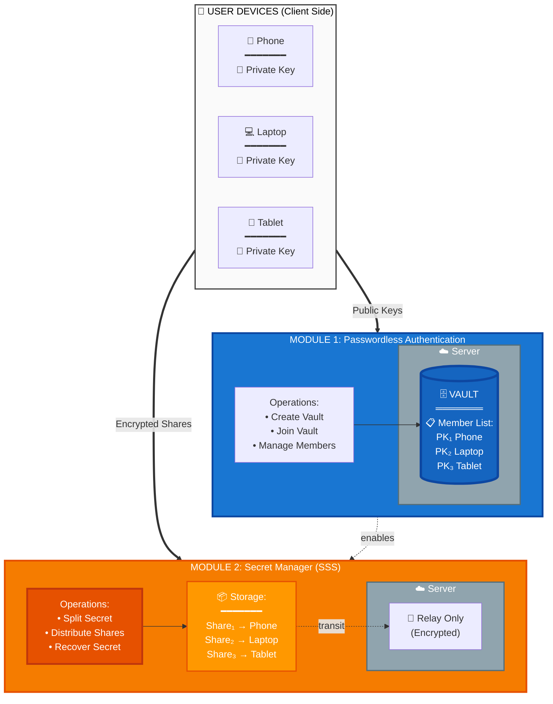
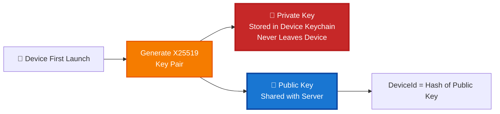
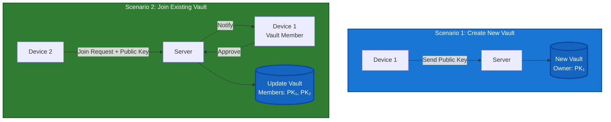
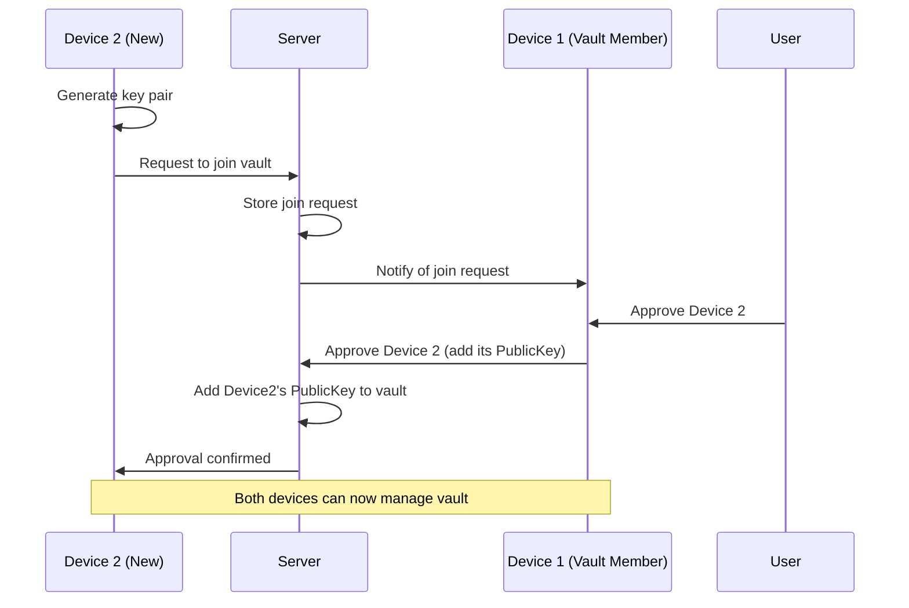
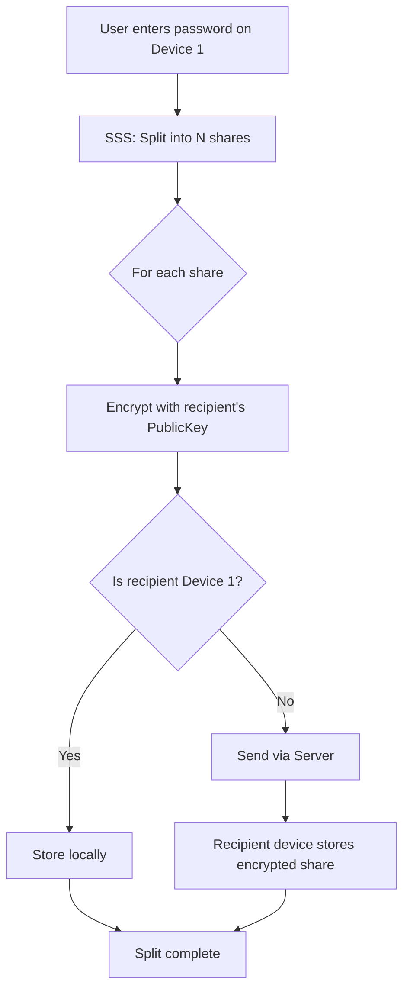
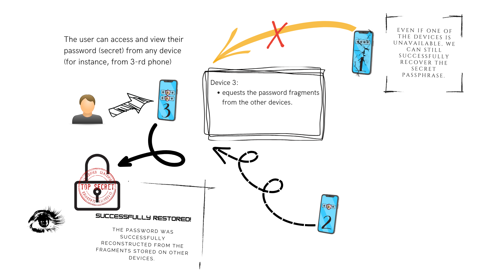
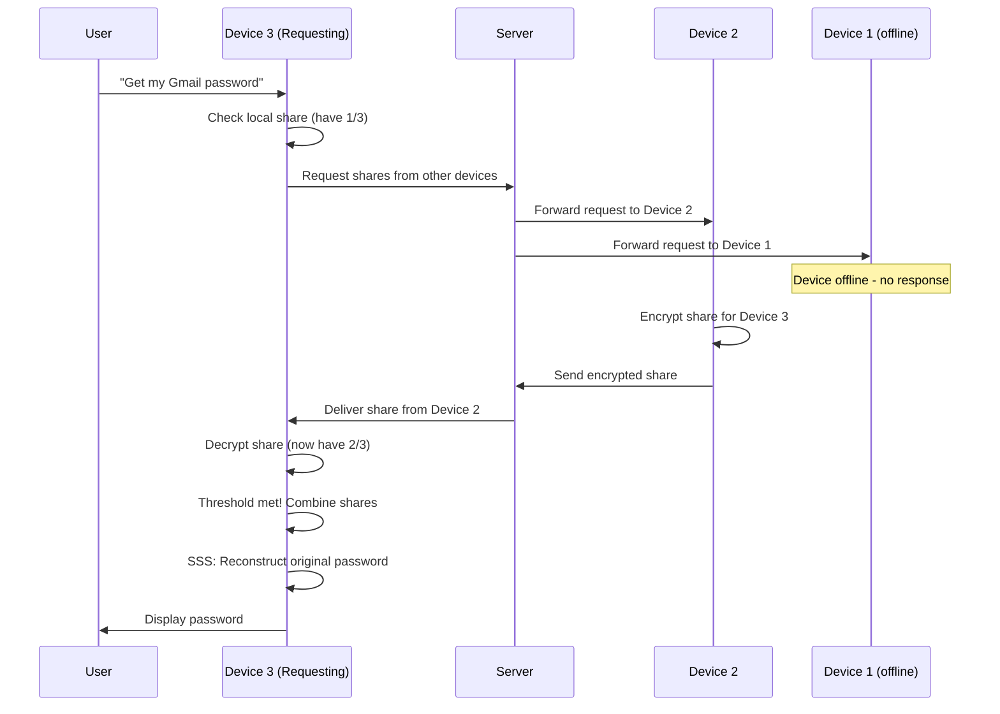
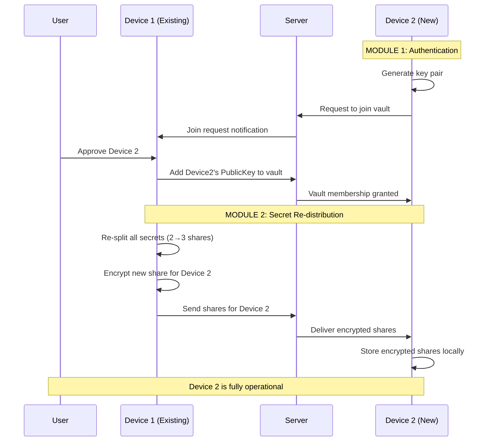
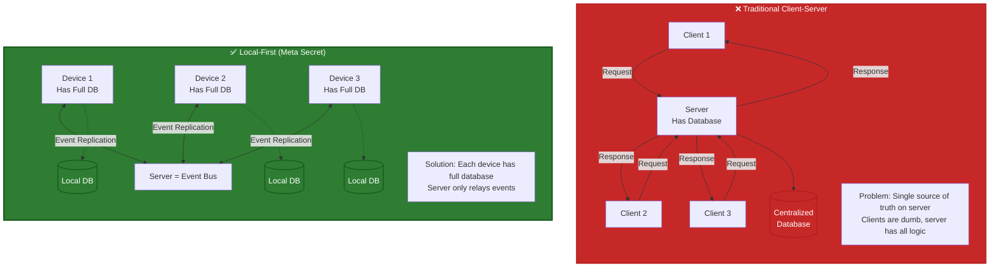
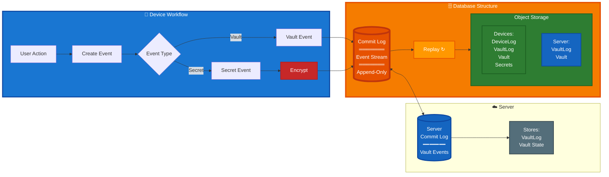

<p align="center">
  
</p>

<h1 align="center">Meta Secret</h1>
<h3 align="center">
    Solving the Master Password Problem with Distributed Cryptography
</h3>

<div align="center">
    <i>Secure Password Management Without a Single Point of Failure</i>
</div>

---

# Slide 2: The Vision

<p align="center">
  
</p>

<p align="center"><em>Your secrets, distributed across multiple secure vaults - no single point of failure</em></p>

> **The Core Idea**: Instead of one master password protecting one vault, 
> Meta Secret distributes your secrets across multiple "vaults" (your devices).
> Opening any single vault reveals nothing - you need a threshold of vaults working together.

---

# Section 1: The Problem

---

# Slide 3: The Paradox of Password Security

## The Problem in Crypto

The industry standard has a fatal flaw:
- **Seed phrase** acts as the master password for your entire wallet
- **Lost seed phrase** = lost Bitcoin/ETH forever (~$140B estimated lost)
- **No recovery mechanism** exists by design

## The Same Problem in Password Managers

Traditional password managers solve the "too many passwords" problem, but create a new **Single Point of Failure**:

- **Forget master password** → Lose access to EVERYTHING
- **Master password compromised** → Attacker gets EVERYTHING

```
┌─────────────────────────────────────────────────────────────┐
│                   TRADITIONAL APPROACH                      │
│                                                             │
│    [Password 1]  ─┐                                         │
│    [Password 2]  ─┼──▶  [Master Password]  ──▶  [Access]    │
│    [Password 3]  ─┤          ⚠️                             │
│    [Password N]  ─┘     SINGLE POINT                        │
│                         OF FAILURE                          │
└─────────────────────────────────────────────────────────────┘
```

---

# Slide 4: The Main Question

## Can We Eliminate the Single Point of Failure?

### Requirements for a Solution

1. **No master password** - Nothing to forget or compromise
2. **No central authority** - No single server that holds all secrets
3. **Self-sovereign** - User maintains complete control
4. **Fault-tolerant** - Recovery possible even with partial data loss
5. **End-to-end encrypted** - No third party can read secrets

### The Key Insight

> What if we could split a secret so that:
> - No single piece reveals anything
> - Multiple pieces can reconstruct the original
> - Losing some pieces doesn't matter

**This is exactly what Meta Secret does.**

---

# Section 2: The Solution Approach

---

# Slide 5: Shamir's Secret Sharing (SSS)

## The Cryptographic Foundation

Invented by **Adi Shamir** in 1979 (the "S" in RSA)

### The Core Concept

Split a secret into **N shares** where any **K shares** can reconstruct it.

### Concrete Example: Password "123"

```
┌─────────────────────────────────────────────────────────────────────┐
│                    SPLITTING THE SECRET                              │
│                                                                      │
│     Original Password: "123"  (contains digits: 1, 2, 3)            │
│                                                                      │
│                         SPLIT (3 shares, need 2)                     │
│                              │                                       │
│              ┌───────────────┼───────────────┐                      │
│              ▼               ▼               ▼                       │
│         Share A          Share B         Share C                     │
│          [1,2]            [1,3]           [2,3]                      │
│                                                                      │
│     Each share has only PARTIAL information                         │
└─────────────────────────────────────────────────────────────────────┘
```

### Recovery: Any 2 Shares → Original Secret

```
   [1,2] + [1,3]  =  {1,2,3}  →  "123" ✓
   [1,2] + [2,3]  =  {1,2,3}  →  "123" ✓
   [1,3] + [2,3]  =  {1,2,3}  →  "123" ✓
   
   [1,2] alone    =  {1,2,?}  →  ???   ✗  (could be 123, 124, 125...)
```

> **Key property**: 1 share reveals nothing. You need the threshold to recover.

---

# Slide 6: Why Decentralized?

## Architectural Decision: No Trusted Server

### Option A: Store Shares on Server ❌

```
┌──────────────────────────────────────┐
│           CENTRALIZED                │
│                                      │
│  [Device] ──▶ [Server stores all] ◀──│
│                    │                 │
│               Trust the server?      │
│               Server compromised?    │
│               Server goes down?      │
└──────────────────────────────────────┘
```

**Problems:**
- Server becomes new single point of failure
- Must trust server operator
- Regulatory/compliance issues

### Option B: User's Own Devices ✅

```
┌──────────────────────────────────────┐
│          DECENTRALIZED               │
│                                      │
│  [Phone] ◀───▶ [Laptop]             │
│      ▲             ▲                 │
│      └─────────────┘                 │
│           │                          │
│      [Tablet]                        │
│                                      │
│    Server = Dumb Relay Only          │
└──────────────────────────────────────┘
```

**Benefits:**
- No single point of compromise
- User controls the trust boundary
- Works offline (sync when connected)

---

# Section 3: Technical Deep Dive

---

# Slide 7: Meta Secret Architecture - Two Core Modules

## System Overview: Two-Module Architecture



### Module Workflows

<table>
<tr>
<td width="50%" valign="top">

**MODULE 1: Authentication Flow**

```
1. Device generates key pair
   └─ Private key: stays on device
   └─ Public key: sent to server

2. First device creates vault
   └─ Server stores: VaultID + PK₁

3. Additional devices join
   └─ Send: PublicKey
   └─ Existing member approves
   └─ Server adds to vault

Result:
✓ Vault on server has all public keys
✓ Zero passwords
✓ Devices authenticate via signatures
```

</td>
<td width="50%" valign="top">

**MODULE 2: Secret Distribution Flow**

```
1. User saves password on Device 1

2. Shamir Secret Sharing
   └─ Split into N shares (N=devices)
   └─ Threshold K = ⌈N/2⌉

3. Encrypt each share
   └─ Use recipient's public key
   └─ End-to-end encryption

4. Distribute via server relay
   └─ Each device stores its share

Result:
✓ Password split across all devices
✓ Need K shares to recover
✓ Server sees only encrypted blobs
```

</td>
</tr>
</table>

### Server Role: Zero-Knowledge

| What Server Stores | What Server CANNOT Do |
|-------------------|----------------------|
| ✅ Public keys (vault members) | ❌ Cannot decrypt shares |
| ✅ Encrypted message blobs | ❌ Cannot impersonate devices |
| ✅ Vault membership metadata | ❌ Cannot read passwords |
| ✅ Device sync state | ❌ Cannot recover secrets alone |

## Two Independent Problems, Two Independent Solutions

```
┌─────────────────────────────────────────────────────────────────┐
│                                                                 │
│  ❓ PROBLEM 1: Master Password                                  │
│  💡 SOLUTION: Public Key Cryptography                           │
│     • Each device = unique key pair                            │
│     • Server stores public keys → builds "vault" (membership)   │
│     • No password to remember or steal                          │
│                                                                 │
├─────────────────────────────────────────────────────────────────┤
│                                                                 │
│  ❓ PROBLEM 2: Single Point of Failure                          │
│  💡 SOLUTION: Shamir's Secret Sharing                           │
│     • Secrets split into N shares                              │
│     • Any K shares can reconstruct                             │
│     • Lose devices? Still recover if threshold met             │
│                                                                 │
└─────────────────────────────────────────────────────────────────┘
```

### Why Separate Modules?

| Module | Solves | Technology | Server Role |
|--------|--------|-----------|-------------|
| **#1 Authentication** | "How to avoid passwords?" | X25519 PKI | Stores public keys |
| **#2 Secret Manager** | "How to avoid single point of failure?" | Shamir's Secret Sharing | Relays encrypted blobs |

---

# Slide 8: Module 1 - Device Identity & Vault Management

## Device Initialization: Key Generation



## Vault Operations



## Authentication Properties

| Aspect | Implementation | Benefit |
|--------|---------------|---------|
| **Key Algorithm** | X25519 (Curve25519) | Industry-standard, 128-bit security |
| **Private Key** | Device keychain + biometric | Hardware-backed, never exposed |
| **Authentication** | Public key cryptography | No password to forget/steal |
| **Server Knowledge** | Public keys only | Cannot impersonate devices |

---

# Slide 9: Module 1 - Device Joining Flow

## How Additional Devices Join the Vault



### Vault Management

Once in the vault, each member can:
- View all vault members (device public keys)
- Approve new device join requests
- Add/remove secrets (triggers Module 2)
- Sync vault state across devices

### Security Property

> Server stores **public keys only** - cannot impersonate devices or decrypt data

---

# Slide 10: Module 2 - Secret Manager

## How Secrets Are Split and Stored

Module 2 uses **Shamir's Secret Sharing** to distribute secrets across vault members.

<p align="center">
  
</p>

### The Split Process



### Key Points

1. **N shares created** - one for each vault member (N = number of devices)
2. **Threshold = majority** - need K shares to recover (e.g., 2 of 3)
3. **End-to-end encryption** - each share encrypted for specific device
4. **Server = relay only** - cannot decrypt any share

---

# Slide 11: Module 2 - Secret Recovery

## How Secrets Are Recovered

<p align="center">
  
</p>

### Recovery Workflow



### Fault Tolerance in Action

- **Started with**: 3 shares distributed across 3 devices
- **Device 1 offline**: Only 2 devices available
- **Threshold = 2**: Success! Password recovered
- **Key insight**: Can lose devices without losing access

---

# Slide 12: How Modules Work Together

## The Complete Flow

### Full User Journey: Adding a New Device



### System Properties

```
┌─────────────────────────────────────────────────────────────┐
│                 WHAT MAKES THIS SECURE                       │
├─────────────────────────────────────────────────────────────┤
│                                                             │
│  Module 1 (Auth): No passwords to steal                    │
│  Module 2 (Secrets): No single point of failure            │
│                                                             │
│  Server role: Relay + public key storage only              │
│  Device role: Private keys + encrypted secret shares       │
│                                                             │
│  Result: True zero-knowledge architecture                  │
│                                                             │
└─────────────────────────────────────────────────────────────┘
```

---

# Slide 13: Application Architecture - Local-First Design

## Traditional vs. Decentralized Architecture



### Why This Matters

| Aspect | Traditional | Meta Secret (Local-First) |
|--------|-------------|---------------------------|
| **Data Location** | Server database | Each device has full copy |
| **Communication** | Request/Response | Event replication |
| **Server Role** | Business logic + storage | Event bus only |
| **Offline Support** | Limited/None | Full functionality |
| **Architecture** | Client-Server | Peer-to-Peer via relay |

---

# Slide 14: Event Sourcing Architecture

## The Core Concept: Commit Log as Central Abstraction



## Database Structure

```
KV Storage (Base Layer)
    ↓
Event Store (Immutable Commit Log)
    ↓
Object Storage Abstraction
    ├── DeviceLog (per-device events)
    ├── VaultLog (vault membership changes)
    ├── Vault (current vault state)
    └── SsWorkflowObject (secret distribution/recovery)
```

### Event Sourcing Benefits

| Challenge | Event Sourcing Solution |
|-----------|------------------------|
| **Conflict Resolution** | Events are append-only, no conflicts |
| **Audit Trail** | Complete history of all changes |
| **Offline Operation** | Store events locally, sync later |
| **State Reconstruction** | Replay events to rebuild any state |
| **Debugging** | Full event log for investigation |

---

# Slide 15: Inspiration - Local-First Software

## Architectural Influences

Meta Secret's architecture is inspired by the **[Local-First Software](https://lofi.so/)** movement and **CRDT** (Conflict-free Replicated Data Types) principles.

### Key Principles Applied

```
┌─────────────────────────────────────────────────────────────────┐
│  LOCAL-FIRST PRINCIPLES                                         │
├─────────────────────────────────────────────────────────────────┤
│                                                                 │
│  1. Data ownership: Your data lives on your devices            │
│     ✓ Each device has complete database                        │
│                                                                 │
│  2. Offline-first: Apps work without internet                  │
│     ✓ Full functionality even when disconnected                │
│                                                                 │
│  3. Collaboration via sync: Not via server                     │
│     ✓ Event replication between peers                          │
│                                                                 │
│  4. Long-term data preservation                                │
│     ✓ Immutable commit log ensures no data loss                │
│                                                                 │
└─────────────────────────────────────────────────────────────────┘
```

### CRDT Influence on Commit Log Design

While Meta Secret doesn't use CRDTs directly, CRDT principles influenced the commit log architecture:

- **Commutativity**: Events can be applied in any order
- **Idempotency**: Same event applied twice = same result
- **Causality Tracking**: Events maintain their relationships
- **Conflict-Free**: Append-only log prevents write conflicts

### The Result

```
Each device operates independently with:
  ├─ Full commit log (event store)
  ├─ Complete database (materialized view)
  ├─ Encrypted events for privacy
  └─ P2P replication (server = message bus)

Instead of: Client → Server Request → Server Response
We have:    Device → Commit Event → Replicate to Peers
```

**Reference**: Learn more at [lofi.so](https://lofi.so/)

---

# Slide 16: Resources

## Learn More

### Links

- **GitHub**: [github.com/meta-secret/meta-secret-core](https://github.com/meta-secret/meta-secret-core)
- **iOS App**: [App Store](https://apps.apple.com/app/metasecret/id1644286751)
- **Web App**: [id0.app](https://id0.app)
- **Website**: [meta-secret.org](https://meta-secret.org)

### Technical References

- Shamir, Adi. "How to share a secret." Communications of the ACM 22.11 (1979): 612-613.
- Age encryption: [github.com/FiloSottile/age](https://github.com/FiloSottile/age)
- SSS Rust implementation: [github.com/dsprenkels/sss-rs](https://github.com/dsprenkels/sss-rs)

---

<h1 align="center">
Q&A
...
<h1>

---

<h1 align="center">
    Thank You
</h1>

<p align="center">
  
</p>

<div align="center">
  <a href="https://github.com/meta-secret/meta-secret-core">GitHub</a> · 
  <a href="https://apps.apple.com/app/metasecret/id1644286751">iOS App</a> · 
  <a href="https://meta-secret.github.io">Web App</a> · 
  <a href="https://meta-secret.org">Website</a>
</div>
