<div align="center">
  

  
# Meta Secret
### Technical Presentation
  
**Solving the Master Password Problem with Distributed Cryptography**
  
*Secure Password Management Without a Single Point of Failure*
  
[](https://github.com/meta-secret/meta-secret-core)
[](https://apps.apple.com/app/metasecret/id1644286751)
[](https://id0.app)
[](https://meta-secret.org)
  
</div>

---

## 📑 Table of Contents

- [🎯 The Vision](#-the-vision)
- [❌ The Problem](#-the-problem)
  - [The Paradox of Password Security](#the-paradox-of-password-security)
- [✅ The Solution](#-the-solution)
  - [The Two-Part Solution](#the-two-part-solution)
  - [Two Core Modules](#two-core-modules)
- [🔧 Technical Architecture](#-technical-architecture)
  - [Module 1: Device Identity & Vault Management](#module-1-device-identity--vault-management)
  - [Module 2: Secret Manager](#module-2-secret-manager)
- [🏗️ Application Architecture](#️-application-architecture)
  - [Local-First Design](#local-first-design)
  - [Event Sourcing Architecture](#event-sourcing-architecture)
- [📚 Resources](#-resources)

---

## 🎯 The Vision

<p align="center">
  
</p>

<p align="center"><em>Your secrets, distributed across multiple secure vaults - no single point of failure</em></p>

> **💡 The Core Idea**: Instead of one master password protecting one vault, Meta Secret distributes your secrets across multiple "vaults" (your devices). Opening any single vault reveals nothing - you need a threshold of vaults working together.

---

## ❌ The Problem

### The Paradox of Password Security

#### 🔐 The Problem in Crypto

The industry standard has a fatal flaw:

- **Seed phrase** acts as the master password for your entire wallet
- **Lost seed phrase** = lost Bitcoin/ETH forever (~$140B estimated lost)
- **No recovery mechanism** exists by design

#### 🔑 The Same Problem in Password Managers

Traditional password managers solve the "too many passwords" problem, but create a new **Single Point of Failure**:

| Risk | Consequence |
|------|-------------|
| **Forget master password** | → Lose access to EVERYTHING |
| **Master password compromised** | → Attacker gets EVERYTHING |

```
Traditional Approach:
  [Password 1]  ─┐
  [Password 2]  ─┼──▶  [Master Password]  ──▶  [Access]
  [Password 3]  ─┤          ⚠️ SINGLE POINT OF FAILURE
  [Password N]  ─┘
```

---

## ✅ The Solution

### The Two-Part Solution

Meta Secret solves both problems using two complementary cryptographic technologies:

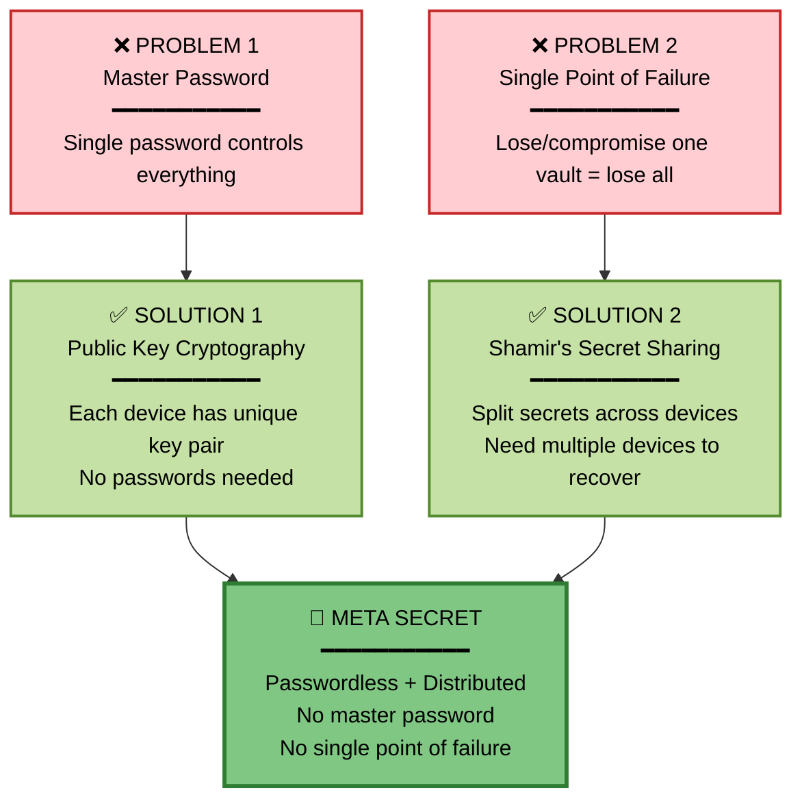
```mermaid
flowchart TB
    PROBLEM1["❌ PROBLEM 1<br/>Master Password<br/>━━━━━━━━━━━<br/>Single password controls everything"] --> SOLUTION1["✅ SOLUTION 1<br/>Public Key Cryptography<br/>━━━━━━━━━━━<br/>Each device has unique key pair<br/>No passwords needed"]
    
    PROBLEM2["❌ PROBLEM 2<br/>Single Point of Failure<br/>━━━━━━━━━━━<br/>Lose/compromise one vault = lose all"] --> SOLUTION2["✅ SOLUTION 2<br/>Shamir's Secret Sharing<br/>━━━━━━━━━━━<br/>Split secrets across devices<br/>Need multiple devices to recover"]
    
    SOLUTION1 --> RESULT["🎯 META SECRET<br/>━━━━━━━━━━━<br/>Passwordless + Distributed<br/>No master password<br/>No single point of failure"]
    SOLUTION2 --> RESULT
    
    style PROBLEM1 fill:#ffcdd2,color:#000,stroke:#c62828,stroke-width:2px
    style PROBLEM2 fill:#ffcdd2,color:#000,stroke:#c62828,stroke-width:2px
    style SOLUTION1 fill:#c5e1a5,color:#000,stroke:#558b2f,stroke-width:2px
    style SOLUTION2 fill:#c5e1a5,color:#000,stroke:#558b2f,stroke-width:2px
    style RESULT fill:#81c784,color:#000,stroke:#2e7d32,stroke-width:3px
```

#### 🔑 Technology 1: Public Key Cryptography (Decentralized Authentication)

- **Purpose**: Eliminate master passwords
- **How it works**: Each device generates a unique cryptographic key pair
  - **Private key** stays on device (secured by biometrics)
  - **Public key** shared with server to build "vault membership"
- **Result**: Zero passwords to remember or steal

#### 🔐 Technology 2: Shamir's Secret Sharing (Distributed Secret Storage)

- **Purpose**: Eliminate single point of failure
- **How it works**: Split each secret into N pieces (shares)
  - Any K shares can reconstruct the original
  - Each device stores one Encrypted Key Share
  - Need threshold of devices to recover
- **Result**: Lose devices? Still recover if threshold met

#### Module Workflows

<table>
<tr>
<th width="50%">MODULE 1: Authentication Flow</th>
<th width="50%">MODULE 2: Secret Distribution Flow</th>
</tr>
<tr>
<td valign="top">

```
1️⃣ Device generates key pair
   └─ Private key: stays on device
   └─ Public key: sent to server

2️⃣ First device creates vault
   └─ Server stores: VaultID + PK₁

3️⃣ Additional devices join
   └─ Send: PublicKey
   └─ Existing member approves
   └─ Server adds to vault

Result:
✅ Vault on server has all public keys
✅ Zero passwords
✅ Devices authenticate via signatures
```

</td>
<td valign="top">

```
1️⃣ User saves password on Device 1

2️⃣ Shamir Secret Sharing
   └─ Split into N shares (N=devices)
   └─ Threshold K = ⌈N/2⌉

3️⃣ Encrypt each share
   └─ Use recipient's public key
   └─ End-to-end encryption

4️⃣ Distribute via server relay
   └─ Each device stores its share

Result:
✅ Password split across all devices
✅ Need K shares to recover
✅ Server sees only encrypted blobs
```

</td>
</tr>
</table>

### Two Core Modules

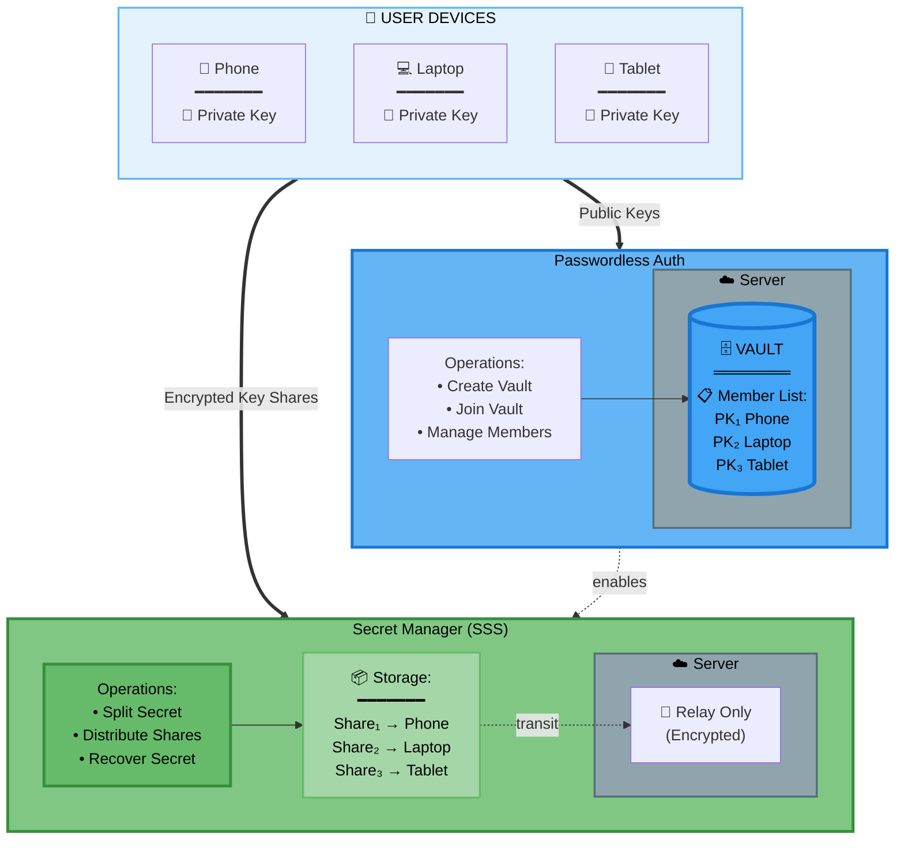
```mermaid
flowchart TB
    subgraph LAYER1["🔐 USER DEVICES"]
        direction TB
        D1["📱 Phone<br/>━━━━━━━<br/>🔑 Private Key"]
        D2["💻 Laptop<br/>━━━━━━━<br/>🔑 Private Key"]
        D3["📲 Tablet<br/>━━━━━━━<br/>🔑 Private Key"]
    end
    
    subgraph LAYER2["Passwordless Auth"]
        direction LR
        
        ACTIONS1["Operations:<br/>• Create Vault<br/>• Join Vault<br/>• Manage Members"]
        
        subgraph SRV1["☁️ Server"]
            VAULT[("🗄️ VAULT<br/>═══════<br/>📋 Member List:<br/>PK₁ Phone<br/>PK₂ Laptop<br/>PK₃ Tablet")]
        end
        
        ACTIONS1 --> VAULT
    end
    
    subgraph LAYER3["Secret Manager (SSS)"]
        direction LR
        
        SPLIT["Operations:<br/>• Split Secret<br/>• Distribute Shares<br/>• Recover Secret"]
        
        SHARES["📦 Storage:<br/>━━━━━━━<br/>Share₁ → Phone<br/>Share₂ → Laptop<br/>Share₃ → Tablet"]
        
        subgraph SRV2["☁️ Server"]
            RELAY["📨 Relay Only<br/>(Encrypted)"]
        end
        
        SPLIT --> SHARES
        SHARES -.->|transit| RELAY
    end
    
    LAYER1 ==>|Public Keys| LAYER2
    LAYER1 ==>|Encrypted Key Shares| LAYER3
    
    LAYER2 -.->|enables| LAYER3
    
    style VAULT fill:#42a5f5,color:#000,stroke:#1976d2,stroke-width:4px
    style SPLIT fill:#66bb6a,color:#000,stroke:#388e3c,stroke-width:3px
    style LAYER1 fill:#e3f2fd,stroke:#64b5f6,stroke-width:2px,color:#000
    style LAYER2 fill:#64b5f6,color:#000,stroke:#1976d2,stroke-width:3px
    style LAYER3 fill:#81c784,color:#000,stroke:#388e3c,stroke-width:3px
    style SRV1 fill:#90a4ae,color:#000,stroke:#546e7a,stroke-width:2px
    style SRV2 fill:#90a4ae,color:#000,stroke:#546e7a,stroke-width:2px
    style SHARES fill:#a5d6a7,color:#000,stroke:#66bb6a,stroke-width:2px
```

---

## 🔧 Technical Architecture
<br>

### Module 1: Device Identity & Vault Management

#### Why Build Our Own Auth (vs Passkeys)?

We want **passwordless authentication** - similar to Passkeys/WebAuthn - where your device *is* your identity. But Meta Secret has additional requirements that standard Passkeys don't support:

**Comparison with Passkeys/WebAuthn:**

| Requirement | Passkeys/WebAuthn | Meta Secret |
|-------------|-------------------|-------------|
| **Key usage** | Authentication only | Authentication + Encryption (Age/X25519) |
| **Who controls keys?** | Platform (Apple/Google/Browser) | Application (we generate and manage) |
| **Who approves new devices?** | Central server or cloud account | Existing vault members (peer-to-peer) |
| **Data location** | Cloud-synced | Local-first (each device has full copy) |
| **Server role** | Full account management | Relay for device messages; may temporarily queue Encrypted Key Share ciphertext |

**Why This Matters:**

1. **End-to-end encryption requires key control**: To encrypt secrets for specific devices, we need access to the raw key material. Passkeys don't expose private keys.

2. **Decentralized trust model**: No single entity (not even our server) can add a device to your vault. Only existing members can approve new ones.

3. **Server minimization**: The server is intentionally "simple" - it relays messages, stores public keys, and may temporarily queue opaque Encrypted Key Share ciphertext until delivery. It cannot impersonate devices or access plaintext secrets.

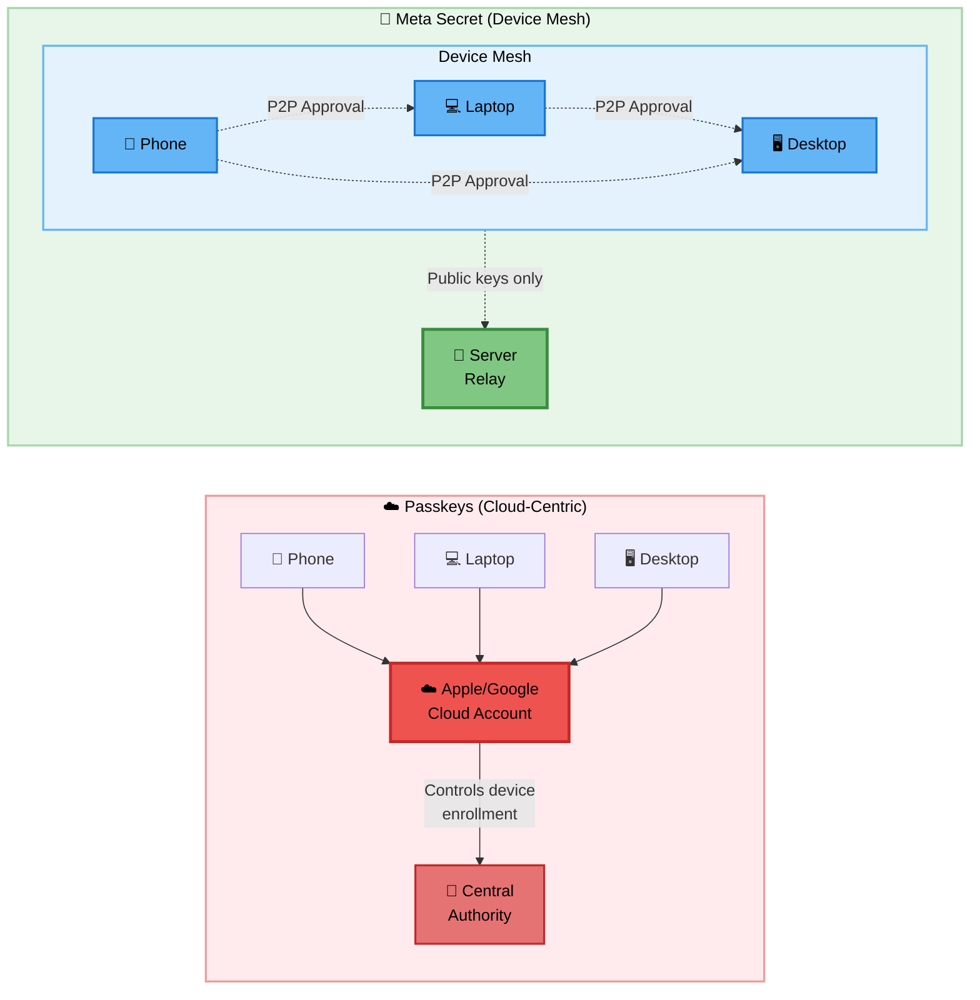
```mermaid
flowchart LR
    subgraph PASSKEY["☁️ Passkeys (Cloud-Centric)"]
        direction TB
        PA[📱 Phone] --> CLOUD[☁️ Apple/Google<br/>Cloud Account]
        PB[💻 Laptop] --> CLOUD
        PC[🖥️ Desktop] --> CLOUD
        CLOUD -->|"Controls device<br/>enrollment"| AUTH[🔐 Central<br/>Authority]
        
        style CLOUD fill:#ef5350,color:#000,stroke:#c62828,stroke-width:3px
        style AUTH fill:#e57373,color:#000,stroke:#c62828,stroke-width:2px
    end
    
    subgraph METASECRET["🔗 Meta Secret (Device Mesh)"]
        direction TB
        
        subgraph DEVICES["Device Mesh"]
            MA[📱 Phone]
            MB[💻 Laptop]
            MC[🖥️ Desktop]
        end
        
        MA -.->|"P2P Approval"| MB
        MB -.->|"P2P Approval"| MC
        MA -.->|"P2P Approval"| MC
        
        DEVICES -.->|"Public keys only"| RELAY[📡 Server<br/>Relay]
        
        style RELAY fill:#81c784,color:#000,stroke:#388e3c,stroke-width:3px
        style MA fill:#64b5f6,color:#000,stroke:#1976d2,stroke-width:2px
        style MB fill:#64b5f6,color:#000,stroke:#1976d2,stroke-width:2px
        style MC fill:#64b5f6,color:#000,stroke:#1976d2,stroke-width:2px
        style DEVICES fill:#e3f2fd,stroke:#64b5f6,stroke-width:2px,color:#000
    end
    
    style PASSKEY fill:#ffebee,stroke:#ef9a9a,stroke-width:2px,color:#000
    style METASECRET fill:#e8f5e9,stroke:#a5d6a7,stroke-width:2px,color:#000
```

> **Core Difference**: In Passkeys, a central authority (Apple ID, Google Account) manages device enrollment. In Meta Secret, devices form a **peer-to-peer trust network** - completely decentralized.

#### Device Initialization: Key Generation

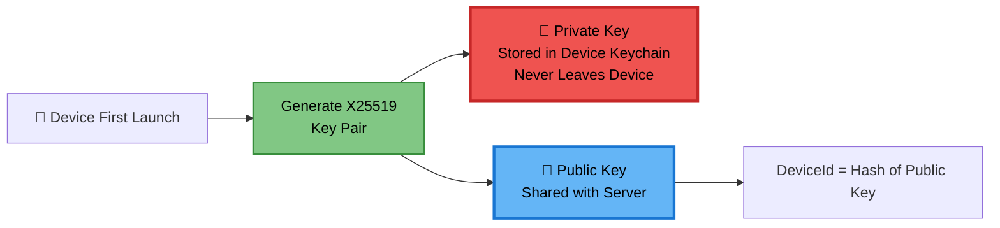
```mermaid
flowchart LR
    DEVICE[📱 Device First Launch] --> KEYGEN[Generate X25519<br/>Key Pair]
    
    KEYGEN --> PRIVATE[🔴 Private Key<br/>Stored in Device Keychain<br/>Never Leaves Device]
    KEYGEN --> PUBLIC[🔵 Public Key<br/>Shared with Server]
    
    PUBLIC --> DEVID[DeviceId = Hash of Public Key]
    
    style PRIVATE fill:#ef5350,color:#000,stroke:#c62828,stroke-width:3px
    style PUBLIC fill:#64b5f6,color:#000,stroke:#1976d2,stroke-width:3px
    style KEYGEN fill:#81c784,color:#000,stroke:#388e3c,stroke-width:2px
```

#### Vault Operations

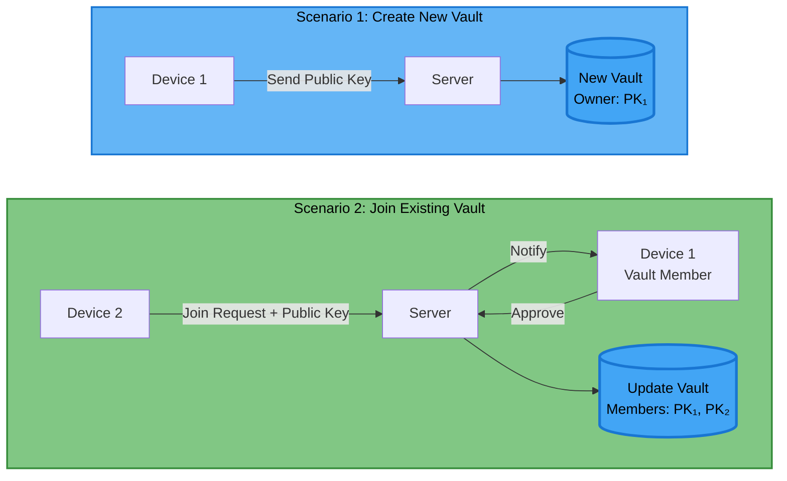
```mermaid
flowchart RL
    subgraph JOIN["Scenario 2: Join Existing Vault"]
        direction LR
        D2[Device 2] -->|Join Request + Public Key| S2[Server]
        S2 -->|Notify| D1B[Device 1<br/>Vault Member]
        D1B -->|Approve| S2
        S2 --> V2[(Update Vault<br/>Members: PK₁, PK₂)]
    end

    subgraph CREATE["Scenario 1: Create New Vault"]
        direction LR
        D1[Device 1] -->|Send Public Key| S1[Server]
        S1 --> V1[(New Vault<br/>Owner: PK₁)]
    end
    
    style V1 fill:#42a5f5,color:#000,stroke:#1976d2,stroke-width:3px
    style V2 fill:#42a5f5,color:#000,stroke:#1976d2,stroke-width:3px
    style CREATE fill:#64b5f6,color:#000,stroke:#1976d2,stroke-width:2px
    style JOIN fill:#81c784,color:#000,stroke:#388e3c,stroke-width:2px
```

---

#### Device Joining Flow

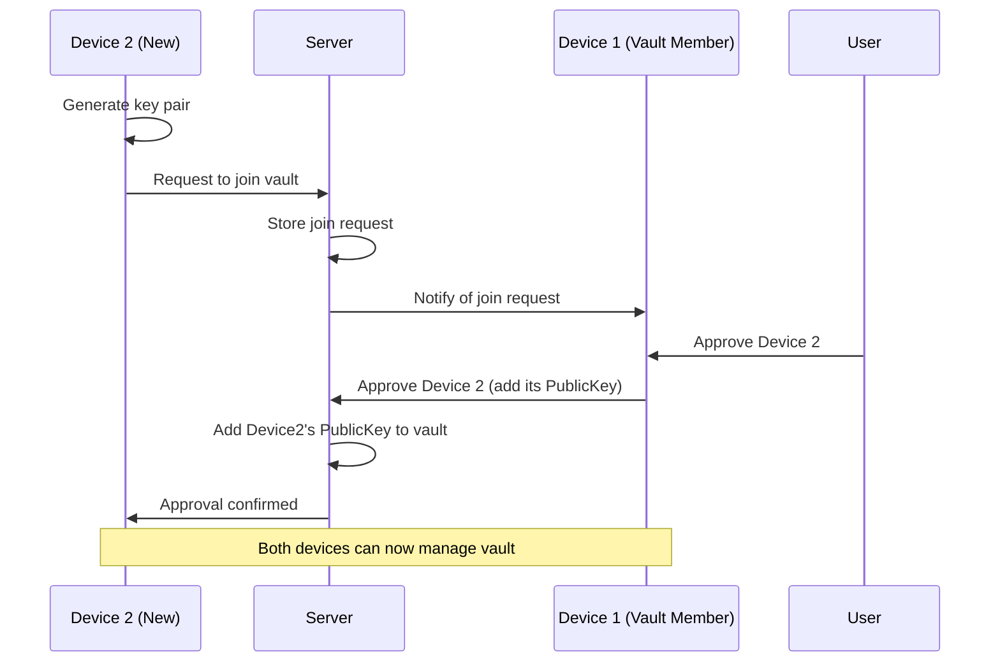
```mermaid
sequenceDiagram
    participant D2 as Device 2 (New)
    participant S as Server
    participant D1 as Device 1 (Vault Member)
    participant User as User
    
    D2->>D2: Generate key pair
    D2->>S: Request to join vault
    S->>S: Store join request
    S->>D1: Notify of join request
    
    User->>D1: Approve Device 2
    D1->>S: Approve Device 2 (add its PublicKey)
    S->>S: Add Device2's PublicKey to vault
    S->>D2: Approval confirmed
    
    Note over D2,D1: Both devices can now manage vault
```

**Vault Management**: Once in the vault, each member can:
- View all vault members (device public keys)
- Approve new device join requests
- Add/remove secrets (triggers Module 2)
- Sync vault state across devices

> **🔒 Security Property**: Server stores public keys and temporary Encrypted Key Share ciphertext only; it cannot impersonate devices or decrypt data.

---

### Module 2: Secret Management

#### How Secrets Are Split and Stored

Module 2 uses **Shamir's Secret Sharing** to distribute secrets across vault members.

Invented by **Adi Shamir** in 1979 (the "S" in RSA)

**Core Concept**: Split a secret into **N shares** where any **K shares** can reconstruct it.

#### Example: Password "123"

```
Original Password: "123" (contains digits: 1, 2, 3)

        SPLIT (3 shares, need 2)
               │
   ┌───────────┼───────────┐
   ▼           ▼           ▼
Share A     Share B     Share C
 [1,2]       [1,3]       [2,3]

Each share has only PARTIAL information
```

#### Recovery: Any 2 Shares → Original Secret

| Combination | Result | Status |
|-------------|--------|---------|
| Share A + Share B | {1,2,3} → "123" | ✅ |
| Share A + Share C | {1,2,3} → "123" | ✅ |
| Share B + Share C | {1,2,3} → "123" | ✅ |
| Share A alone | {1,2,?} → ??? | ❌ Could be 123, 124, 125... |

> **🔒 Key property**: 1 share reveals nothing. You need the threshold to recover.

---

#### Server Role: Zero-Knowledge

| What Server Stores | What Server CANNOT Do |
|-------------------|----------------------|
| ✅ Public keys (vault members) | ❌ Cannot decrypt shares |
| ✅ Temporary Encrypted Key Share ciphertext while delivery is pending | ❌ Cannot impersonate devices |
| ✅ Vault membership metadata | ❌ Cannot read passwords |
| ✅ Device sync state | ❌ Cannot recover secrets alone |


#### How Secrets Are Split and Stored

<p align="center">
  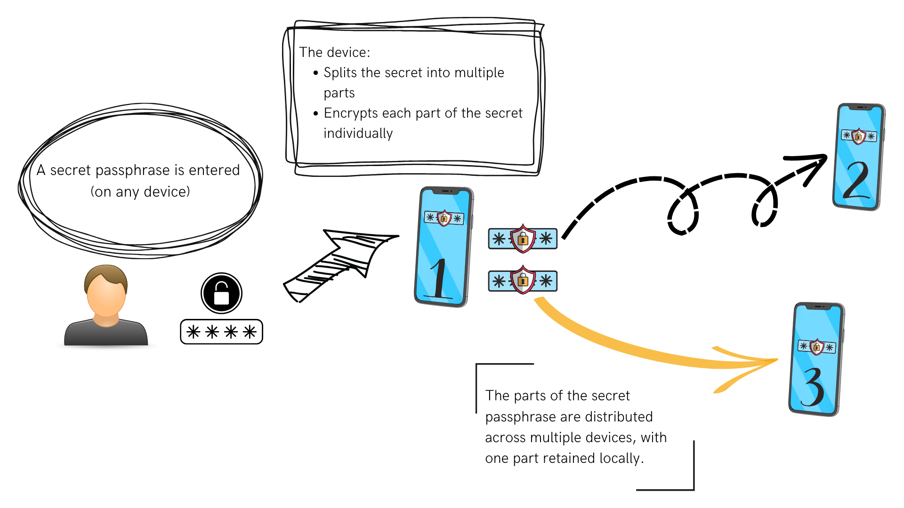
</p>

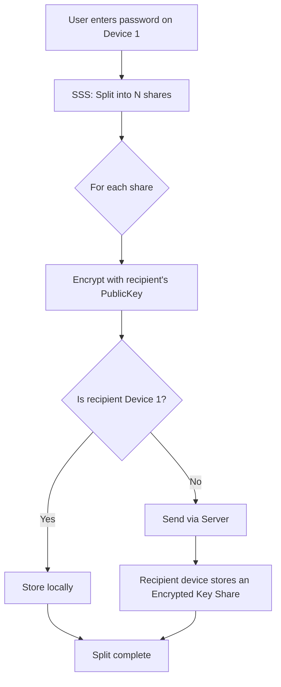
```mermaid
flowchart TD
    A[User enters password on Device 1] --> B[SSS: Split into N shares]
    B --> C{For each share}
    C --> D[Encrypt with recipient's PublicKey]
    D --> E{Is recipient Device 1?}
    E -->|Yes| F[Store locally]
    E -->|No| G[Send via Server]
    G --> H[Recipient device stores an Encrypted Key Share]
    F --> I[Split complete]
    H --> I
```

**Key Points:**

1. **N shares created** - one for each vault member (N = number of devices)
2. **Threshold = majority** - need K shares to recover (e.g., 2 of 3)
3. **End-to-end encryption** - each share encrypted for specific device
4. **Server = relay only** - it may temporarily queue Encrypted Key Share ciphertext, but cannot decrypt any Key Share

---

#### Secret Recovery

<p align="center">
  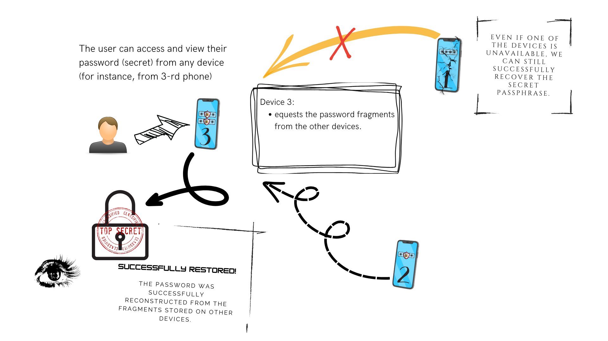
</p>

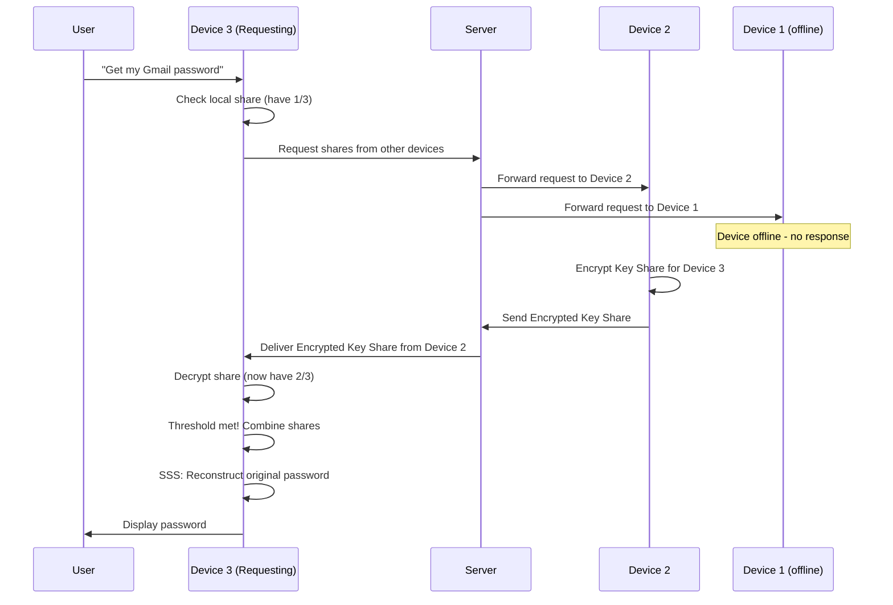
```mermaid
sequenceDiagram
    participant User
    participant D3 as Device 3 (Requesting)
    participant S as Server
    participant D2 as Device 2
    participant D1 as Device 1 (offline)

    User->>D3: "Get my Gmail password"
    D3->>D3: Check local share (have 1/3)
    
    D3->>S: Request shares from other devices
    S->>D2: Forward request to Device 2
    S->>D1: Forward request to Device 1
    
    Note over D1: Device offline - no response
    
    D2->>D2: Encrypt Key Share for Device 3
    D2->>S: Send Encrypted Key Share
    S->>D3: Deliver Encrypted Key Share from Device 2
    
    D3->>D3: Decrypt share (now have 2/3)
    D3->>D3: Threshold met! Combine shares
    D3->>D3: SSS: Reconstruct original password
    D3->>User: Display password
```

**Fault Tolerance in Action:**

- **Started with**: 3 shares distributed across 3 devices
- **Device 1 offline**: Only 2 devices available
- **Threshold = 2**: Success! Password recovered
- **Key insight**: Can lose devices without losing access

---

#### Complete Flow: Adding a New Device

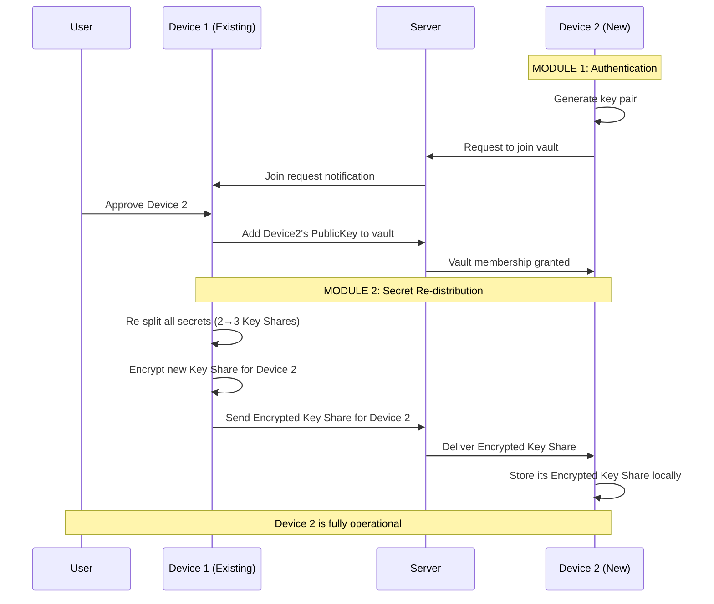
```mermaid
sequenceDiagram
    participant U as User
    participant D1 as Device 1 (Existing)
    participant S as Server
    participant D2 as Device 2 (New)

    Note over D2: MODULE 1: Authentication
    
    D2->>D2: Generate key pair
    D2->>S: Request to join vault
    S->>D1: Join request notification
    U->>D1: Approve Device 2
    D1->>S: Add Device2's PublicKey to vault
    S->>D2: Vault membership granted
    
    Note over D1,D2: MODULE 2: Secret Re-distribution
    
    D1->>D1: Re-split all secrets (2→3 Key Shares)
    D1->>D1: Encrypt new Key Share for Device 2
    D1->>S: Send Encrypted Key Share for Device 2
    S->>D2: Deliver Encrypted Key Share
    D2->>D2: Store its Encrypted Key Share locally
    
    Note over U,D2: Device 2 is fully operational
```

---

## 🏗️ Application Architecture

### Local-First Design

#### Traditional vs. Decentralized Architecture

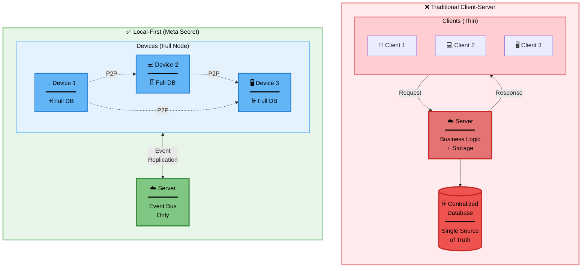
```mermaid
flowchart TB
    subgraph TRAD["❌ Traditional Client-Server"]
        direction TB
        
        subgraph CLIENTS1["Clients (Thin)"]
            direction TB
            C1[📱 Client 1]
            C2[💻 Client 2]
            C3[🖥️ Client 3]
        end
        
        CLIENTS1 -->|Request| SRV[☁️ Server<br/>━━━━━━━━<br/>Business Logic<br/>+ Storage]
        SRV -->|Response| CLIENTS1
        
        SRV --> DB[(🗄️ Centralized<br/>Database<br/>━━━━━━━━<br/>Single Source<br/>of Truth)]
        
        style SRV fill:#e57373,color:#000,stroke:#c62828,stroke-width:3px
        style DB fill:#ef5350,color:#000,stroke:#c62828,stroke-width:3px
        style CLIENTS1 fill:#ffcdd2,stroke:#e57373,stroke-width:2px,color:#000
    end
    
    subgraph LOCAL["✅ Local-First (Meta Secret)"]
        direction TB
        
        subgraph DEVICES["Devices (Full Node)"]
            direction LR
            D1["📱 Device 1<br/>━━━━━━━━<br/>🗄️ Full DB"]
            D2["💻 Device 2<br/>━━━━━━━━<br/>🗄️ Full DB"]
            D3["🖥️ Device 3<br/>━━━━━━━━<br/>🗄️ Full DB"]

            D1 -.->|P2P| D2
            D2 -.->|P2P| D3
            D1 -.->|P2P| D3
        end
        
        DEVICES <-->|Event<br/>Replication| BUS[☁️ Server<br/>━━━━━━━━<br/>Event Bus<br/>Only]
        
        style BUS fill:#81c784,color:#000,stroke:#388e3c,stroke-width:3px
        style D1 fill:#64b5f6,color:#000,stroke:#1976d2,stroke-width:2px
        style D2 fill:#64b5f6,color:#000,stroke:#1976d2,stroke-width:2px
        style D3 fill:#64b5f6,color:#000,stroke:#1976d2,stroke-width:2px
        style DEVICES fill:#e3f2fd,stroke:#64b5f6,stroke-width:2px,color:#000
    end
    
    style TRAD fill:#ffebee,stroke:#ef9a9a,stroke-width:3px,color:#000
    style LOCAL fill:#e8f5e9,stroke:#a5d6a7,stroke-width:3px,color:#000
```

#### Why This Matters

| Aspect | Traditional | Meta Secret (Local-First) |
|--------|-------------|---------------------------|
| **Data Location** | Server database | Each device has full copy |
| **Communication** | Request/Response | Event replication |
| **Server Role** | Business logic + storage | Event bus only |
| **Offline Support** | Limited/None | Full functionality |
| **Architecture** | Client-Server | Peer-to-Peer via relay |

---

### Event Sourcing Architecture

#### Why Event Sourcing? The Architectural Journey

Meta Secret's core requirement is clear: **secrets must stay on user's devices**. No server should ever store or have access to them. This single constraint drives the entire architecture:

**1. Secrets must be local → logic moves to the device**
Since the server cannot see or process secrets, all the encryption, splitting, and recovery logic must run on the device itself. The server becomes nothing more than a message relay.

**2. No central database for secrets**
In a traditional password manager, the server owns the database. But Meta Secret's server **cannot store secrets** - so where does the data live? On each device, in its own local database.

**3. Local databases must stay in sync**
Each device holds its own share of secrets and vault state. When a user adds a new password or a new device joins the vault, all devices need to know about it:

- Traditional REST API (request/response) **no longer works** - there's no central source of truth to query
- What *does* work in distributed systems: **commit log + state machine replication** - the same principle behind Kafka, Raft, and database replication

**4. Commit Log + State Machine Replication = Meta Secret's Architecture**

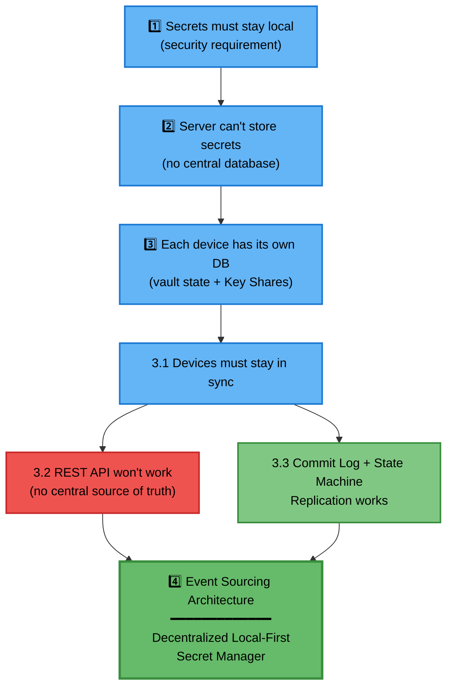
```mermaid
flowchart TB
    A["1️⃣ Secrets must stay local<br/>(security requirement)"] --> B["2️⃣ Server can't store secrets<br/>(no central database)"]
    B --> C["3️⃣ Each device has its own DB<br/>(vault state + Key Shares)"]
    C --> D["3.1 Devices must stay in sync"]
    D --> E["3.2 REST API won't work<br/>(no central source of truth)"]
    D --> F["3.3 Commit Log + State Machine<br/>Replication works"]
    E --> G["4️⃣ Event Sourcing Architecture<br/>━━━━━━━━━━━━━<br/>Decentralized Local-First<br/>Secret Manager"]
    F --> G
    
    style A fill:#64b5f6,color:#000,stroke:#1976d2,stroke-width:2px
    style B fill:#64b5f6,color:#000,stroke:#1976d2,stroke-width:2px
    style C fill:#64b5f6,color:#000,stroke:#1976d2,stroke-width:2px
    style D fill:#64b5f6,color:#000,stroke:#1976d2,stroke-width:2px
    style E fill:#ef5350,color:#000,stroke:#c62828,stroke-width:2px
    style F fill:#81c784,color:#000,stroke:#388e3c,stroke-width:2px
    style G fill:#66bb6a,color:#000,stroke:#388e3c,stroke-width:3px
```

> Each device maintains an **append-only commit log** of vault events and Encrypted Key Shares. Events are replicated between devices via the server relay. Each device replays the log to build its current state - vault membership, secret distribution status, and recovery workflows.

---

#### The Core Concept: Commit Log as Central Abstraction

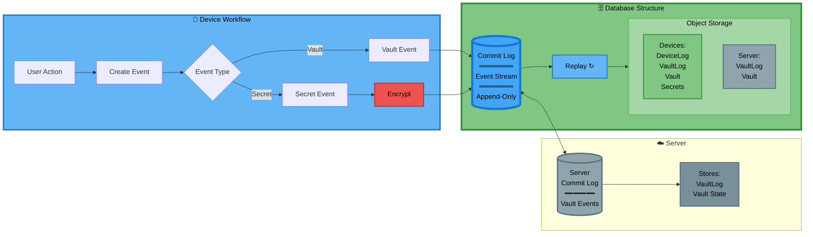
```mermaid
flowchart LR
    subgraph DEVICES["📱 Device Workflow"]
        direction TB
        USER[User Action] --> EVENT[Create Event]
        EVENT --> CHECK{Event Type}
        CHECK -->|Vault| VEVT[Vault Event]
        CHECK -->|Secret| SEVT[Secret Event]
        SEVT --> ENC[Encrypt]
    end
    
    subgraph DB["🗄️ Database Structure"]
        direction TB
        
        LOG[(Commit Log<br/>═══════<br/>Event Stream<br/>═══════<br/>Append-Only)]
        
        LOG --> BUILD[Replay ↻]
        
        subgraph OBJSTORE["Object Storage"]
            VDEV[Devices:<br/>DeviceLog<br/>VaultLog<br/>Vault<br/>Secrets]
            VSRV[Server:<br/>VaultLog<br/>Vault]
        end
        
        BUILD --> OBJSTORE
    end
    
    subgraph SERVER["☁️ Server"]
        direction TB
        SRVLOG[(Server<br/>Commit Log<br/>━━━━━━━<br/>Vault Events)]
        SRVSTORE[Stores:<br/>VaultLog<br/>Vault State]
        
        SRVLOG --> SRVSTORE
    end
    
    VEVT --> LOG
    ENC --> LOG
    
    LOG <--> SRVLOG
    
    style LOG fill:#42a5f5,color:#000,stroke:#1976d2,stroke-width:5px
    style BUILD fill:#64b5f6,color:#000,stroke:#1976d2,stroke-width:2px
    style SRVLOG fill:#90a4ae,color:#000,stroke:#546e7a,stroke-width:3px
    style SRVSTORE fill:#78909c,color:#000,stroke:#546e7a,stroke-width:2px
    style VDEV fill:#81c784,color:#000,stroke:#388e3c,stroke-width:2px
    style VSRV fill:#90a4ae,color:#000,stroke:#546e7a,stroke-width:2px
    style ENC fill:#ef5350,color:#000,stroke:#c62828,stroke-width:2px
    style DEVICES fill:#64b5f6,color:#000,stroke:#1976d2,stroke-width:3px
    style DB fill:#81c784,color:#000,stroke:#388e3c,stroke-width:4px
    style OBJSTORE fill:#a5d6a7,color:#000,stroke:#66bb6a,stroke-width:2px
```

#### Database Structure

```
KV Storage (Base Layer)
    ↓
Event Store (Immutable Commit Log)
    ↓
Object Storage Abstraction
    ├── DeviceLog (per-device events)
    ├── VaultLog (vault membership changes)
    ├── Vault (current vault state)
    └── SsWorkflowObject (secret distribution/recovery)
```

#### Event Sourcing Benefits

| Challenge | Event Sourcing Solution |
|-----------|------------------------|
| **Conflict Resolution** | Events are append-only, no conflicts |
| **Audit Trail** | Complete history of all changes |
| **Offline Operation** | Store events locally, sync later |
| **State Reconstruction** | Replay events to rebuild any state |
| **Debugging** | Full event log for investigation |

---

### Local-First Software

Meta Secret's architecture respects the **[Local-First Software](https://lofi.so/)** 
and **CRDT** (Conflict-free Replicated Data Types) principles.

#### Key Principles Applied

<table>
<tr>
<td width="50%" valign="top">

**📝 LOCAL-FIRST PRINCIPLES**

1. **Data ownership**: Your data lives on your devices
   - ✅ Each device has complete database

2. **Offline-first**: Apps work without internet
   - ✅ Full functionality even when disconnected

3. **Collaboration via sync**: Not via server
   - ✅ Event replication between peers

4. **Long-term data preservation**
   - ✅ Immutable commit log ensures no data loss

</td>

</tr>
</table>

#### The Result

```
Each device operates independently with:
  ├─ Full commit log (event store)
  ├─ Complete database (materialized view)
  ├─ Encrypted events for privacy
  └─ P2P replication (server = message bus)

Instead of: Client → Server Request → Server Response
We have:    Device → Commit Event → Replicate to Peers
```

#### Database Structure (Vault)

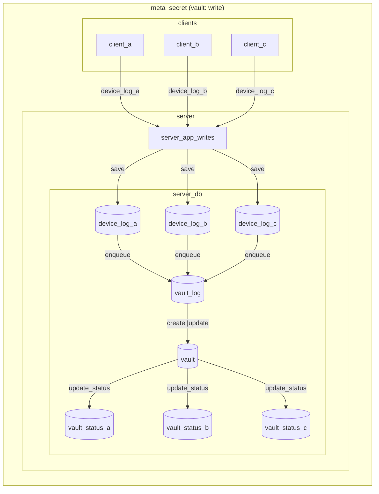
```mermaid

flowchart TD
    subgraph "meta_secret (vault: write)"
        direction TB

        subgraph clients
            client_a
            client_b
            client_c
        end

        subgraph server
            subgraph server_db
                device_log_a[(device_log_a)]
                device_log_b[(device_log_b)]
                device_log_c[(device_log_c)]

                vault_log[(vault_log)]
                vault[(vault)]
                
                vault_status_a[(vault_status_a)]
                vault_status_b[(vault_status_b)]
                vault_status_c[(vault_status_c)]
            end

            client_a--device_log_a-->server_app_writes

            client_b--device_log_b-->server_app_writes
            client_c--device_log_c-->server_app_writes

            server_app_writes--save-->device_log_a
            server_app_writes--save-->device_log_b
            server_app_writes--save-->device_log_c

            device_log_a--enqueue-->vault_log
            device_log_b--enqueue-->vault_log
            device_log_c--enqueue-->vault_log
            vault_log--create||update-->vault
            
            vault--update_status-->vault_status_a
            vault--update_status-->vault_status_b
            vault--update_status-->vault_status_c
        end
    end
```

---

### Unit Testing: The Hidden Benefit of Local-First

Because the **entire state lives on the client** and the **server is a transparent relay**, complex distributed logic can be tested with simple unit tests - no Docker containers, no network mocking, no test servers needed.

#### Why Local-First Makes Testing Easy

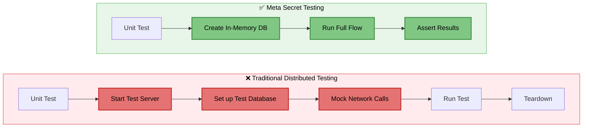
```mermaid
flowchart LR
    subgraph TRADITIONAL["❌ Traditional Distributed Testing"]
        direction LR
        T1[Unit Test] --> T2[Start Test Server]
        T2 --> T3[Set up Test Database]
        T3 --> T4[Mock Network Calls]
        T4 --> T5[Run Test]
        T5 --> T6[Teardown]
        
        style T2 fill:#e57373,color:#000,stroke:#c62828,stroke-width:2px
        style T3 fill:#e57373,color:#000,stroke:#c62828,stroke-width:2px
        style T4 fill:#e57373,color:#000,stroke:#c62828,stroke-width:2px
    end
    
    subgraph METASECRET["✅ Meta Secret Testing"]
        direction LR
        M1[Unit Test] --> M2[Create In-Memory DB]
        M2 --> M3[Run Full Flow]
        M3 --> M4[Assert Results]
        
        style M2 fill:#81c784,color:#000,stroke:#388e3c,stroke-width:2px
        style M3 fill:#81c784,color:#000,stroke:#388e3c,stroke-width:2px
        style M4 fill:#81c784,color:#000,stroke:#388e3c,stroke-width:2px
    end
    
    style TRADITIONAL fill:#ffebee,stroke:#ef9a9a,stroke-width:2px,color:#000
    style METASECRET fill:#e8f5e9,stroke:#a5d6a7,stroke-width:2px,color:#000
```

#### Key Insight

| Traditional Testing | Meta Secret Testing |
|---------------------|---------------------|
| Need real/mock servers | In-memory database (`InMemKvLogEventRepo`) |
| Network round-trips | Direct function calls |
| Complex test infrastructure | Simple Rust unit tests |
| Flaky due to network | Deterministic and fast |
| Hard to test edge cases | Full control over state |

#### Real Example: Testing the Full Distributed Flow

The entire **sign up → join vault → split secret → recover secret** flow is tested as a regular Rust unit test:

```rust
// Full sign-up and device join flow - tested as a simple unit test!
#[tokio::test]
async fn test_sign_up_and_join_two_devices() -> Result<()> {
    let spec = ServerAppSignUpSpec::build().await?;
    spec.sign_up_and_second_devices_joins().await?;
    Ok(())
}

// Secret splitting across devices - no real network needed
#[tokio::test]
async fn test_secret_split() -> Result<()> {
    let spec = ServerAppSignUpSpec::build().await?;
    let split = SplitSpec { spec };

    split.spec.sign_up_and_second_devices_joins().await?;
    split.split().await?;

    Ok(())
}

// Full recovery flow: split → request recovery → reconstruct password
#[tokio::test]
async fn test_recover() -> Result<()> {
    // ... setup sign up + join + split ...

    // Request recovery from another device
    let recover = GenericAppStateRequest::Recover(pass_id);
    vd_client_service.handle_client_request(vd_app_state, recover).await?;

    // Sync events between devices (via in-memory gateway)
    split.spec.client_gw_sync().await?;
    split.spec.vd_gw_sync().await?;

    // Recover the original password from shares
    let pass = recovery_handler.recover(user_creds, claim_id, pass_id).await?;

    // The original password is fully reconstructed!
    assert_eq!("2bee|~", pass.text);

    Ok(())
}
```

> **The entire distributed system** - multiple devices, server relay, Shamir's Secret Sharing, encryption, recovery - all tested in a single process with in-memory storage. This is only possible because the architecture is truly local-first.

---

## 📚 Resources

### 🔗 Links

<div align="center">

[](https://github.com/meta-secret/meta-secret-core)
[](https://apps.apple.com/app/metasecret/id1644286751)
[](https://id0.app)
[](https://meta-secret.org)

</div>

### 📖 Technical References

- **Shamir's Secret Sharing**: Shamir, Adi. "How to share a secret." *Communications of the ACM* 22.11 (1979): 612-613.
- **Age Encryption**: [github.com/FiloSottile/age](https://github.com/FiloSottile/age)
- **SSS Rust Implementation**: [github.com/dsprenkels/sss-rs](https://github.com/dsprenkels/sss-rs)
- **Local-First Software**: [lofi.so](https://lofi.so/)

---

<div align="center">


### Thank You

*Questions? Open an issue on [GitHub](https://github.com/meta-secret/meta-secret-core/issues)*

</div>
