```mermaid
flowchart LR
    DEVICE[📱 Device First Launch] --> KEYGEN[Generate X25519<br/>Key Pair]
    
    KEYGEN --> PRIVATE[🔴 Private Key<br/>Stored in Device Keychain<br/>Never Leaves Device]
    KEYGEN --> PUBLIC[🔵 Public Key<br/>Shared with Server]
    
    PUBLIC --> DEVID[DeviceId = Hash of Public Key]
    
    style PRIVATE fill:#c62828,color:#fff,stroke:#b71c1c,stroke-width:3px
    style PUBLIC fill:#1976d2,color:#fff,stroke:#0d47a1,stroke-width:3px
    style KEYGEN fill:#f57c00,color:#fff,stroke:#e65100,stroke-width:2px
```

```mermaid
flowchart TB
    subgraph CREATE["Scenario 1: Create New Vault"]
        D1[Device 1] -->|Send Public Key| S1[Server]
        S1 --> V1[(New Vault<br/>Owner: PK₁)]
    end
    
    subgraph JOIN["Scenario 2: Join Existing Vault"]
        D2[Device 2] -->|Join Request + Public Key| S2[Server]
        S2 -->|Notify| D1B[Device 1<br/>Vault Member]
        D1B -->|Approve| S2
        S2 --> V2[(Update Vault<br/>Members: PK₁, PK₂)]
    end
    
    style V1 fill:#1565c0,color:#fff,stroke:#0d47a1,stroke-width:3px
    style V2 fill:#1565c0,color:#fff,stroke:#0d47a1,stroke-width:3px
    style CREATE fill:#1976d2,color:#fff,stroke:#0d47a1,stroke-width:2px
    style JOIN fill:#2e7d32,color:#fff,stroke:#1b5e20,stroke-width:2px
```

```mermaid
flowchart LR
    subgraph DEVICES["📱 Device Workflow"]
        direction TB
        USER[User Action] --> EVENT[Create Event]
        EVENT --> CHECK{Event Type}
        CHECK -->|Vault| VEVT[Vault Event]
        CHECK -->|Secret| SEVT[Secret Event]
        SEVT --> ENC[Encrypt]
    end
    
    subgraph DB["🗄️ Database Structure"]
        direction TB
        
        LOG[(Commit Log<br/>═══════<br/>Event Stream<br/>═══════<br/>Append-Only)]
        
        LOG --> BUILD[Replay ↻]
        
        subgraph OBJSTORE["Object Storage"]
            VDEV[Devices:<br/>DeviceLog<br/>VaultLog<br/>Vault<br/>Secrets]
            VSRV[Server:<br/>VaultLog<br/>Vault]
        end
        
        BUILD --> OBJSTORE
    end
    
    subgraph SERVER["☁️ Server"]
        direction TB
        SRVLOG[(Server<br/>Commit Log<br/>━━━━━━━<br/>Vault Events)]
        SRVSTORE[Stores:<br/>VaultLog<br/>Vault State]
        
        SRVLOG --> SRVSTORE
    end
    
    VEVT --> LOG
    ENC --> LOG
    
    LOG <--> SRVLOG
    
    style LOG fill:#e65100,color:#fff,stroke:#bf360c,stroke-width:5px
    style BUILD fill:#ff9800,color:#fff,stroke:#e65100,stroke-width:2px
    style SRVLOG fill:#1565c0,color:#fff,stroke:#0d47a1,stroke-width:3px
    style SRVSTORE fill:#546e7a,color:#fff,stroke:#37474f,stroke-width:2px
    style VDEV fill:#2e7d32,color:#fff,stroke:#1b5e20,stroke-width:2px
    style VSRV fill:#1565c0,color:#fff,stroke:#0d47a1,stroke-width:2px
    style ENC fill:#c62828,color:#fff,stroke:#b71c1c,stroke-width:2px
    style DEVICES fill:#1976d2,color:#fff,stroke:#0d47a1,stroke-width:3px
    style DB fill:#f57c00,color:#fff,stroke:#e65100,stroke-width:4px
    style OBJSTORE fill:#2e7d32,color:#fff,stroke:#1b5e20,stroke-width:2px
```

<div align="center">
  

  
# Meta Secret
### Technical Presentation
  
**Solving the Master Password Problem with Distributed Cryptography**
  
*Secure Password Management Without a Single Point of Failure*
  
[](https://github.com/meta-secret/meta-secret-core)
[](https://apps.apple.com/app/metasecret/id1644286751)
[](https://id0.app)
[](https://meta-secret.org)
  
</div>

---

## 📑 Table of Contents

- [🎯 The Vision](#-the-vision)
- [❌ The Problem](#-the-problem)
  - [The Paradox of Password Security](#the-paradox-of-password-security)
- [✅ The Solution](#-the-solution)
  - [The Two-Part Solution](#the-two-part-solution)
  - [Shamir's Secret Sharing](#shamirs-secret-sharing-sss)
  - [Why Decentralized?](#why-decentralized)
- [🔧 Technical Architecture](#-technical-architecture)
  - [Two Core Modules](#two-core-modules)
  - [Module 1: Device Identity & Vault Management](#module-1-device-identity--vault-management)
  - [Module 2: Secret Manager](#module-2-secret-manager)
- [🏗️ Application Architecture](#️-application-architecture)
  - [Local-First Design](#local-first-design)
  - [Event Sourcing](#event-sourcing-architecture)
- [📚 Resources](#-resources)

---

## 🎯 The Vision

<p align="center">
  
</p>

<p align="center"><em>Your secrets, distributed across multiple secure vaults - no single point of failure</em></p>

> **💡 The Core Idea**: Instead of one master password protecting one vault, Meta Secret distributes your secrets across multiple "vaults" (your devices). Opening any single vault reveals nothing - you need a threshold of vaults working together.

---

## The Problem

### The Paradox of Password Security

#### 🔐 The Problem in Crypto

The industry standard has a fatal flaw:

- **Seed phrase** acts as the master password for your entire wallet
- **Lost seed phrase** = lost Bitcoin/ETH forever (~$140B estimated lost)
- **No recovery mechanism** exists by design

#### 🔑 The Same Problem in Password Managers

Traditional password managers solve the "too many passwords" problem, but create a new **Single Point of Failure**:

| Risk | Consequence |
|------|-------------|
| **Forget master password** | → Lose access to EVERYTHING |
| **Master password compromised** | → Attacker gets EVERYTHING |

```
Traditional Approach:
  [Password 1]  ─┐
  [Password 2]  ─┼──▶  [Master Password]  ──▶  [Access]
  [Password 3]  ─┤          ⚠️ SINGLE POINT OF FAILURE
  [Password N]  ─┘
```

---

## ✅ The Solution

### The Two-Part Solution

Meta Secret solves both problems using two complementary cryptographic technologies:


#### 🔑 Technology 1: Public Key Cryptography (Decentralized Authentication)

- **Purpose**: Eliminate master passwords
- **How it works**: Each device generates a unique cryptographic key pair
  - **Private key** stays on device (secured by biometrics)
  - **Public key** shared with server to build "vault membership"
- **Result**: Zero passwords to remember or steal

#### 🔐 Technology 2: Shamir's Secret Sharing (Distributed Secret Storage)

- **Purpose**: Eliminate single point of failure
- **How it works**: Split each secret into N pieces (shares)
  - Any K shares can reconstruct the original
  - Each device stores one encrypted share
  - Need threshold of devices to recover
- **Result**: Lose devices? Still recover if threshold met

#### Module Workflows

<table>
<tr>
<th width="50%">MODULE 1: Authentication Flow</th>
<th width="50%">MODULE 2: Secret Distribution Flow</th>
</tr>
<tr>
<td valign="top">

```
1️⃣ Device generates key pair
   └─ Private key: stays on device
   └─ Public key: sent to server

2️⃣ First device creates vault
   └─ Server stores: VaultID + PK₁

3️⃣ Additional devices join
   └─ Send: PublicKey
   └─ Existing member approves
   └─ Server adds to vault

Result:
✅ Vault on server has all public keys
✅ Zero passwords
✅ Devices authenticate via signatures
```

</td>
<td valign="top">

```
1️⃣ User saves password on Device 1

2️⃣ Shamir Secret Sharing
   └─ Split into N shares (N=devices)
   └─ Threshold K = ⌈N/2⌉

3️⃣ Encrypt each share
   └─ Use recipient's public key
   └─ End-to-end encryption

4️⃣ Distribute via server relay
   └─ Each device stores its share

Result:
✅ Password split across all devices
✅ Need K shares to recover
✅ Server sees only encrypted blobs
```

</td>
</tr>
</table>

---

## 🔧 Technical Architecture

### Shamir's Secret Sharing (SSS)

#### 🧮 The Cryptographic Foundation

Invented by **Adi Shamir** in 1979 (the "S" in RSA)

**Core Concept**: Split a secret into **N shares** where any **K shares** can reconstruct it.

#### Example: Password "123"

```
Original Password: "123" (contains digits: 1, 2, 3)

        SPLIT (3 shares, need 2)
               │
   ┌───────────┼───────────┐
   ▼           ▼           ▼
Share A     Share B     Share C
 [1,2]       [1,3]       [2,3]

Each share has only PARTIAL information
```

#### Recovery: Any 2 Shares → Original Secret

| Combination | Result | Status |
|-------------|--------|---------|
| Share A + Share B | {1,2,3} → "123" | ✅ |
| Share A + Share C | {1,2,3} → "123" | ✅ |
| Share B + Share C | {1,2,3} → "123" | ✅ |
| Share A alone | {1,2,?} → ??? | ❌ Could be 123, 124, 125... |

> **🔒 Key property**: 1 share reveals nothing. You need the threshold to recover.

---

### Two Core Modules

```mermaid
flowchart TB
    subgraph LAYER1["🔐 USER DEVICES"]
        direction LR
        D1["📱 Phone<br/>━━━━━━━<br/>🔑 Private Key"]
        D2["💻 Laptop<br/>━━━━━━━<br/>🔑 Private Key"]
        D3["📲 Tablet<br/>━━━━━━━<br/>🔑 Private Key"]
    end
    
    subgraph LAYER2["MODULE 1: Passwordless Authentication"]
        direction LR
        
        ACTIONS1["Operations:<br/>• Create Vault<br/>• Join Vault<br/>• Manage Members"]
        
        subgraph SRV1["☁️ Server"]
            VAULT[("🗄️ VAULT<br/>═══════<br/>📋 Member List:<br/>PK₁ Phone<br/>PK₂ Laptop<br/>PK₃ Tablet")]
        end
        
        ACTIONS1 --> VAULT
    end
    
    subgraph LAYER3["MODULE 2: Secret Manager (SSS)"]
        direction LR
        
        SPLIT["Operations:<br/>• Split Secret<br/>• Distribute Shares<br/>• Recover Secret"]
        
        SHARES["📦 Storage:<br/>━━━━━━━<br/>Share₁ → Phone<br/>Share₂ → Laptop<br/>Share₃ → Tablet"]
        
        subgraph SRV2["☁️ Server"]
            RELAY["📨 Relay Only<br/>(Encrypted)"]
        end
        
        SPLIT --> SHARES
        SHARES -.->|transit| RELAY
    end
    
    LAYER1 ==>|Public Keys| LAYER2
    LAYER1 ==>|Encrypted Shares| LAYER3
    
    LAYER2 -.->|enables| LAYER3
    
    style VAULT fill:#1565c0,color:#fff,stroke:#0d47a1,stroke-width:4px
    style SPLIT fill:#e65100,color:#fff,stroke:#bf360c,stroke-width:3px
    style LAYER1 fill:#fafafa,stroke:#424242,stroke-width:2px,color:#000
    style LAYER2 fill:#1976d2,color:#fff,stroke:#0d47a1,stroke-width:3px
    style LAYER3 fill:#f57c00,color:#fff,stroke:#e65100,stroke-width:3px
    style SRV1 fill:#90a4ae,color:#fff,stroke:#546e7a,stroke-width:2px
    style SRV2 fill:#90a4ae,color:#fff,stroke:#546e7a,stroke-width:2px
    style SHARES fill:#ff9800,color:#fff,stroke:#e65100,stroke-width:2px
```



#### Server Role: Zero-Knowledge

| What Server Stores | What Server CANNOT Do |
|-------------------|----------------------|
| ✅ Public keys (vault members) | ❌ Cannot decrypt shares |
| ✅ Encrypted message blobs | ❌ Cannot impersonate devices |
| ✅ Vault membership metadata | ❌ Cannot read passwords |
| ✅ Device sync state | ❌ Cannot recover secrets alone |

---

### Module 1: Device Identity & Vault Management

#### Device Initialization: Key Generation



#### Vault Operations



#### Why Build Our Own Auth (vs Passkeys)?

We want **passwordless authentication** - similar to Passkeys/WebAuthn - where your device *is* your identity. But Meta Secret has additional requirements that standard Passkeys don't support:

**Comparison with Passkeys/WebAuthn:**

| Requirement | Passkeys/WebAuthn | Meta Secret |
|-------------|-------------------|-------------|
| **Key usage** | Authentication only | Authentication + Encryption (Age/X25519) |
| **Who controls keys?** | Platform (Apple/Google/Browser) | Application (we generate and manage) |
| **Who approves new devices?** | Central server or cloud account | Existing vault members (peer-to-peer) |
| **Data location** | Cloud-synced | Local-first (each device has full copy) |
| **Server role** | Full account management | Dumb relay - just passes messages |

**Why This Matters:**

1. **End-to-end encryption requires key control**: To encrypt secrets for specific devices, we need access to the raw key material. Passkeys don't expose private keys.

2. **Decentralized trust model**: No single entity (not even our server) can add a device to your vault. Only existing members can approve new ones.

3. **Server minimization**: The server is intentionally "dumb" - it relays messages and stores public keys. It cannot impersonate devices or access secrets.

```mermaid
flowchart LR
    subgraph PASSKEY["☁️ Passkeys (Cloud-Centric)"]
        direction TB
        PA[📱 Phone] --> CLOUD[☁️ Apple/Google<br/>Cloud Account]
        PB[💻 Laptop] --> CLOUD
        PC[🖥️ Desktop] --> CLOUD
        CLOUD -->|"Controls device<br/>enrollment"| AUTH[🔐 Central<br/>Authority]
        
        style CLOUD fill:#f44336,color:#fff,stroke:#c62828,stroke-width:3px
        style AUTH fill:#d32f2f,color:#fff,stroke:#b71c1c,stroke-width:2px
    end
    
    subgraph METASECRET["🔗 Meta Secret (Device Mesh)"]
        direction TB
        MA[📱 Phone] <-->|"P2P Approval"| MB[💻 Laptop]
        MB <-->|"P2P Approval"| MC[🖥️ Desktop]
        MA <-->|"P2P Approval"| MC
        
        MA -.->|"Public keys only"| RELAY[📡 Server<br/>Relay]
        MB -.-> RELAY
        MC -.-> RELAY
        
        style RELAY fill:#4caf50,color:#fff,stroke:#2e7d32,stroke-width:3px
        style MA fill:#1976d2,color:#fff,stroke:#0d47a1,stroke-width:2px
        style MB fill:#1976d2,color:#fff,stroke:#0d47a1,stroke-width:2px
        style MC fill:#1976d2,color:#fff,stroke:#0d47a1,stroke-width:2px
    end
    
    style PASSKEY fill:#ffebee,stroke:#ef9a9a,stroke-width:2px
    style METASECRET fill:#e8f5e9,stroke:#a5d6a7,stroke-width:2px
```



> **Core Difference**: In Passkeys, a central authority (Apple ID, Google Account) manages device enrollment. In Meta Secret, devices form a **peer-to-peer trust network** - completely decentralized.

---

#### Authentication Properties

| Aspect | Implementation | Benefit |
|--------|---------------|---------|
| **Key Algorithm** | X25519 (Curve25519) | Industry-standard, 128-bit security |
| **Private Key** | Device keychain + biometric | Hardware-backed, never exposed |
| **Authentication** | Public key cryptography | No password to forget/steal |
| **Server Knowledge** | Public keys only | Cannot impersonate devices |

---

#### Device Joining Flow


**Vault Management**: Once in the vault, each member can:
- View all vault members (device public keys)
- Approve new device join requests
- Add/remove secrets (triggers Module 2)
- Sync vault state across devices

> **🔒 Security Property**: Server stores public keys only - cannot impersonate devices or decrypt data

---

### Module 2: Secret Manager

#### How Secrets Are Split and Stored

<p align="center">
  
</p>


**Key Points:**

1. **N shares created** - one for each vault member (N = number of devices)
2. **Threshold = majority** - need K shares to recover (e.g., 2 of 3)
3. **End-to-end encryption** - each share encrypted for specific device
4. **Server = relay only** - cannot decrypt any share

---

#### Secret Recovery

<p align="center">
  
</p>


**Fault Tolerance in Action:**

- **Started with**: 3 shares distributed across 3 devices
- **Device 1 offline**: Only 2 devices available
- **Threshold = 2**: Success! Password recovered
- **Key insight**: Can lose devices without losing access

---

#### Complete Flow: Adding a New Device


---

## 🏗️ Application Architecture

### Local-First Design

#### Traditional vs. Decentralized Architecture


#### Why This Matters

| Aspect | Traditional | Meta Secret (Local-First) |
|--------|-------------|---------------------------|
| **Data Location** | Server database | Each device has full copy |
| **Communication** | Request/Response | Event replication |
| **Server Role** | Business logic + storage | Event bus only |
| **Offline Support** | Limited/None | Full functionality |
| **Architecture** | Client-Server | Peer-to-Peer via relay |

---

### Event Sourcing Architecture

#### The Core Concept: Commit Log as Central Abstraction



#### Database Structure

```
KV Storage (Base Layer)
    ↓
Event Store (Immutable Commit Log)
    ↓
Object Storage Abstraction
    ├── DeviceLog (per-device events)
    ├── VaultLog (vault membership changes)
    ├── Vault (current vault state)
    └── SsWorkflowObject (secret distribution/recovery)
```

#### Event Sourcing Benefits

| Challenge | Event Sourcing Solution |
|-----------|------------------------|
| **Conflict Resolution** | Events are append-only, no conflicts |
| **Audit Trail** | Complete history of all changes |
| **Offline Operation** | Store events locally, sync later |
| **State Reconstruction** | Replay events to rebuild any state |
| **Debugging** | Full event log for investigation |

---

### Inspiration: Local-First Software

Meta Secret's architecture is inspired by the **[Local-First Software](https://lofi.so/)** movement and **CRDT** (Conflict-free Replicated Data Types) principles.

#### Key Principles Applied

<table>
<tr>
<td width="50%" valign="top">

**📝 LOCAL-FIRST PRINCIPLES**

1. **Data ownership**: Your data lives on your devices
   - ✅ Each device has complete database

2. **Offline-first**: Apps work without internet
   - ✅ Full functionality even when disconnected

3. **Collaboration via sync**: Not via server
   - ✅ Event replication between peers

4. **Long-term data preservation**
   - ✅ Immutable commit log ensures no data loss

</td>
<td width="50%" valign="top">

**🔄 CRDT INFLUENCE**

While Meta Secret doesn't use CRDTs directly, CRDT principles influenced the commit log architecture:

- **Commutativity**: Events can be applied in any order
- **Idempotency**: Same event applied twice = same result
- **Causality Tracking**: Events maintain their relationships
- **Conflict-Free**: Append-only log prevents write conflicts

</td>
</tr>
</table>

#### The Result

```
Each device operates independently with:
  ├─ Full commit log (event store)
  ├─ Complete database (materialized view)
  ├─ Encrypted events for privacy
  └─ P2P replication (server = message bus)

Instead of: Client → Server Request → Server Response
We have:    Device → Commit Event → Replicate to Peers
```

**Reference**: Learn more at [lofi.so](https://lofi.so/)

---

## 📚 Resources

### 🔗 Links

<div align="center">

[](https://github.com/meta-secret/meta-secret-core)
[](https://apps.apple.com/app/metasecret/id1644286751)
[](https://id0.app)
[](https://meta-secret.org)

</div>

### 📖 Technical References

- **Shamir's Secret Sharing**: Shamir, Adi. "How to share a secret." *Communications of the ACM* 22.11 (1979): 612-613.
- **Age Encryption**: [github.com/FiloSottile/age](https://github.com/FiloSottile/age)
- **SSS Rust Implementation**: [github.com/dsprenkels/sss-rs](https://github.com/dsprenkels/sss-rs)
- **Local-First Software**: [lofi.so](https://lofi.so/)

---

<div align="center">


### Thank You

*Questions? Open an issue on [GitHub](https://github.com/meta-secret/meta-secret-core/issues)*

</div>
