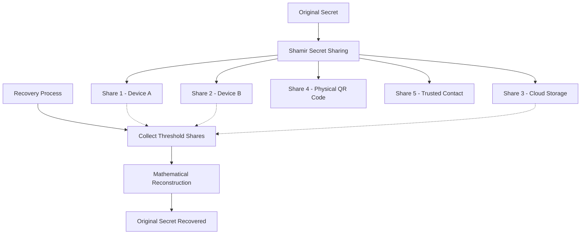

# Meta Secret: Comprehensive Overview

## What is Meta Secret?

Meta Secret is a **decentralized password manager** that revolutionizes how we secure and manage sensitive information. Unlike traditional password managers that rely on a single master password, Meta Secret uses advanced cryptographic techniques to eliminate this single point of failure while providing secure, convenient access to your secrets across multiple devices.

## Core Purpose & Vision

Meta Secret addresses the fundamental problem with conventional password managers: **the master password vulnerability**. If someone gains access to your master password, all your secrets are compromised. Meta Secret solves this by:

- **Eliminating master passwords** entirely
- **Distributing trust** across multiple devices and locations  
- **Using biometric authentication** for secure access
- **Providing true decentralization** with no central authority or cloud dependency

## How It Works: Shamir Secret Sharing

At its core, Meta Secret employs **Shamir Secret Sharing (SSS)**, a cryptographic algorithm that splits any secret into multiple "shares" with these key properties:

### The Magic of Threshold Cryptography

```
Secret → Split into N shares → Requires only K shares to recover
```

**Example**: Your password is split into 5 shares, but you only need any 3 shares to recover the original password.

### Technical Process

1. **Secret Splitting**:
   - Your secret (password, private key, etc.) is split into multiple encrypted shares
   - Each share is mathematically related but reveals nothing about the original secret
   - Shares are encoded as both JSON files and QR codes for flexibility

2. **Distributed Storage**:
   - Store shares in different locations (devices, secure locations, trusted contacts)
   - No single location contains enough information to compromise your secret
   - Decentralized approach eliminates single points of failure

3. **Recovery Process**:
   - Collect the minimum threshold number of shares
   - Mathematical reconstruction recovers the original secret
   - Works with any valid combination of shares above the threshold

## Architecture & Components

### Multi-Platform Ecosystem

Meta Secret provides a complete ecosystem of applications:

#### 🔧 **Core Library** (`meta-secret/core/`)
- Rust-based cryptographic engine
- Implements Shamir Secret Sharing algorithm
- Provides encryption/decryption primitives
- Cross-platform compatibility layer

#### 📱 **Mobile Applications** (`meta-secret/mobile/`)
- **iOS App**: Native Swift/Objective-C integration with Rust core
- **Android App**: Native Java/Kotlin integration with Rust core
- Biometric authentication (Touch ID, Face ID, fingerprint)
- QR code scanning and generation

#### 🌐 **Web Application** (`meta-secret/web-cli/`)
- Vue.js-based progressive web app
- WASM integration for client-side cryptography
- No server-side secret processing
- Responsive design for all devices

#### ⚡ **Command Line Interface** (`meta-secret/meta-cli/`)
- Full-featured CLI for power users
- Docker containerization for easy deployment
- Scriptable operations for automation
- Cross-platform binary distribution

#### 🖥️ **Server Components** (`meta-secret/meta-server/`)
- Optional coordination server (never sees secrets)
- Device synchronization without secret exposure
- Decentralized protocol implementation

### Security Architecture



## Key Features & Benefits

### 🔐 **Enhanced Security**
- **No master password**: Eliminates the biggest security vulnerability
- **Cryptographic splitting**: Uses proven mathematical algorithms
- **Biometric access**: Touch ID, Face ID, fingerprint authentication
- **End-to-end encryption**: Secrets never leave your control unencrypted

### 🌍 **True Decentralization**
- **No cloud dependency**: Works entirely offline if desired
- **No central authority**: You control all aspects of your security
- **Distributed trust**: No single point of failure
- **Privacy-first**: Your secrets are never visible to any third party

### 🔄 **Flexibility & Convenience**
- **Cross-platform**: iOS, Android, Web, CLI, Desktop
- **Multiple formats**: JSON files and QR codes for maximum portability
- **Configurable thresholds**: Customize security vs. convenience
- **Easy recovery**: Simple process to regain access

### ⚡ **Performance & Reliability**
- **Rust-powered core**: Memory-safe, high-performance cryptography
- **Offline-first**: Works without internet connectivity
- **Lightweight**: Minimal resource requirements
- **Battle-tested**: Based on decades-old cryptographic research

## Use Cases

### 👤 **Personal Password Management**
- Store all your passwords without a master password
- Backup across multiple devices and locations
- Secure access using biometrics
- Peace of mind with distributed security

### 🏢 **Enterprise Secret Management**
- Distribute administrative secrets across team members
- Implement m-of-n policies (e.g., 3 of 5 executives required)
- Reduce insider threat risks
- Maintain audit trails without exposing secrets

### 🔑 **Cryptocurrency & Digital Assets**
- Split private keys across multiple secure locations
- Implement corporate treasury controls
- Protect against single points of failure
- Enable secure inheritance planning

### 🏥 **Critical Infrastructure**
- Distribute emergency access codes
- Implement multi-party authorization
- Protect against coercion scenarios
- Maintain operational security

## Technical Specifications

### Cryptographic Primitives
- **Secret Sharing**: Shamir Secret Sharing over finite fields
- **Encryption**: DHE_ChaCha20_Poly1305 (Integrated Encryption Scheme)
- **Key Exchange**: Diffie-Hellman Ephemeral
- **Authentication**: ChaCha20-Poly1305 authenticated encryption

### Data Formats
- **JSON**: Human-readable share format for digital storage
- **QR Codes**: High-density 2D barcodes for physical backup
- **Base64**: Text encoding for maximum compatibility

### Platform Support
- **Mobile**: iOS 12+, Android 8+ (API level 26+)
- **Web**: Modern browsers with WASM support
- **Desktop**: Windows, macOS, Linux
- **CLI**: Cross-platform binaries and Docker containers

## Getting Started

### Quick Start with CLI
```bash
# Split a secret into 5 shares (need any 3 to recover)
docker run -ti --rm -v "$(pwd)/secrets:/app/secrets" \
  ghcr.io/meta-secret/cli:latest split --secret "my-super-secret-password"

# Recover from shares
docker run -ti --rm -v "$(pwd)/secrets:/app/secrets" \
  ghcr.io/meta-secret/cli:latest restore --from qr
```

### Web Application
Visit [meta-secret.github.io](https://meta-secret.github.io) for the browser-based interface.

### Mobile Applications
- **iOS**: [Meta Secret on App Store](https://apps.apple.com/app/metasecret/id1644286751)
- **Android**: Available through GitHub releases

## Security Model

### Threat Model
Meta Secret protects against:
- ✅ **Single device compromise**: Other shares remain secure
- ✅ **Cloud provider breaches**: No secrets stored in cloud
- ✅ **Master password attacks**: No master password exists
- ✅ **Coercion attacks**: Threshold prevents single-point coercion
- ✅ **Insider threats**: Distributed trust model

### Trust Assumptions
- Users properly secure their individual shares
- Threshold number of shares won't be simultaneously compromised
- Underlying cryptographic primitives remain secure
- Physical security of QR codes if used

## Comparison with Traditional Solutions

| Feature | Traditional Password Managers | Meta Secret |
|---------|------------------------------|-------------|
| Master Password | Required (single point of failure) | None (distributed) |
| Cloud Storage | Usually required | Optional |
| Device Compromise | Full exposure risk | Partial exposure only |
| Offline Operation | Limited functionality | Full functionality |
| Corporate Controls | Basic sharing | Sophisticated m-of-n policies |
| Inheritance | Complex recovery processes | Mathematical certainty |

## Future Roadmap

- **Hardware Security Module (HSM) integration**
- **Blockchain-based coordination (optional)**
- **Advanced policy engines**
- **Formal security verification**
- **Integration with existing enterprise systems**

## Contributing

Meta Secret is open-source and welcomes contributions:
- **Core Development**: Rust expertise in cryptography
- **Mobile Development**: iOS/Android native integration
- **Web Development**: Vue.js and WASM experience
- **Security Research**: Cryptographic analysis and review
- **Documentation**: User guides and technical documentation

## Conclusion

Meta Secret represents a paradigm shift in secret management, moving from centralized trust models to distributed cryptographic security. By eliminating master passwords and using proven mathematical algorithms, it provides unprecedented security while maintaining practical usability across all major platforms.

Whether you're an individual looking to secure your digital life or an organization implementing enterprise-grade secret management, Meta Secret offers a robust, flexible, and truly secure solution built on solid cryptographic foundations.

---

*For technical documentation, see the `/docs` directory. For development setup, see the main README.md.*